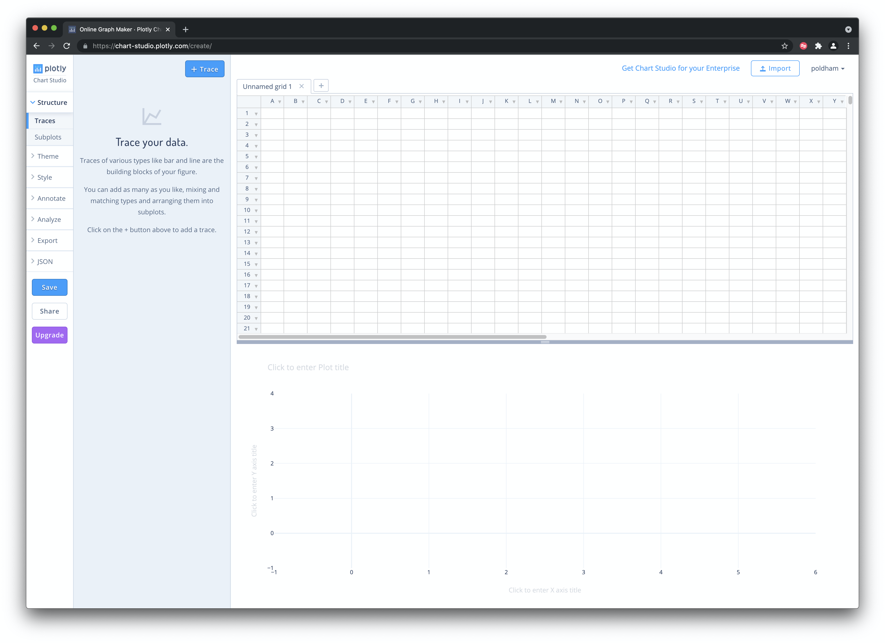
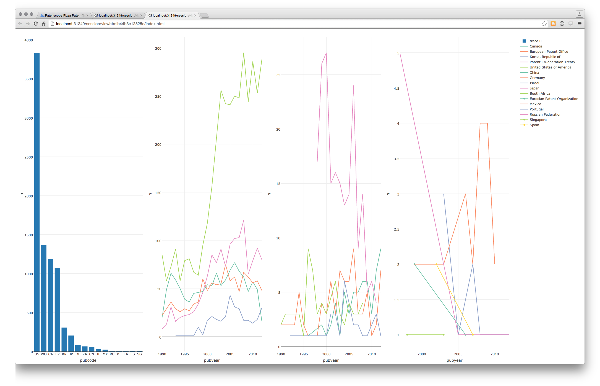

# Patent Analytics with Plotly
<!--- last spell checked 2022-09-29--->
## Introduction

In this chapter we provide an introduction to the online graphing service [Plotly Chart Studio](https://chart-studio.plotly.com/feed/#/) to create graphics for use in patent analysis.

Plotly is an online graphing service that allows you to import excel, text and other files for visualisation. It also has API services for R, Python, MATLAB and a Plotly Javascript Library. A recent update to the `plotly` package in R allows you to easily produce graphics directly in RStudio and to send the graphics to Plotly online for further editing and to share with others.

Plotly's great strength is that it produces attractive interactive graphics that can easily be shared with colleagues or made public. It also has a wide variety of graph types including contour and heat maps and is built with the very popular [D3.js](http://d3js.org) Javascript library for interactive graphics. For examples of graphics created with Plotly explore the [public gallery](https://chart-studio.plotly.com/feed/#/) on the main page. Plotly was founded in 2012 and has split into different product areas with free and priced offerings. We focus on the free tier of [Plotly Chart Studio](https://chart-studio.plotly.com/feed/#/) to help you get started. Our aim in this chapter is to get you started with using Plotly online with .csv or Excel files. In the second part of the chapter we will focus on using the `plotly` package in RStudio to generate and export graphs to Plotly Chart Studio online.

## Getting Started with Plotly

We need to start out by creating an account using the Create Account Button.

```{r plotlyfig1, echo=FALSE, fig.align='center'}

```

When you have signed up and logged in you will see a button that says `+ Create` with a range of different options. Choose `Chart`.

## Importing Files

We choose `+ Create` and `Chart` and will see an area to upload our data as a `Trace`, plotly's term for the data.

```{r plotlyfig2, echo=FALSE, fig.align='center'}

```

In this Workspace area you will see an Import Icon that provides a range of options for importing data. 
```{r fig3_plotly, echo=FALSE, message=FALSE, fig.align='center'}

```

You can also copy data from a file and paste it into the Grid or use other data sources.

```{r fig4_plotly, echo=FALSE, message=FALSE, fig.align='center'}

```

From the Organize page select the New button and then Upload. Now select your local file. When you upload the file a status message will display and if all goes well then you will see a completed message. If not a red message will display informing you that there has been a problem (how you fix these problems is unclear).


For this experiment we used two datasets from the [Open Source Patent Analytics Manual data repository](https://github.com/wipo-analytics/manual/tree/main/data). When using the Github repository click on the file of interest until you see a `View Raw` message. Then right click to download the data file from there using `Save As' and not forgetting to include the file type`.csv\`. You can download them for your own use directly from the following links.

1.  [WIPO trends](https://raw.githubusercontent.com/wipo-analytics/manual/main/data/wipo/wipotrends_cleaned.csv) application trends by year and with % change.
2.  [Pizza patents by country and year](https://raw.githubusercontent.com/wipo-analytics/manual/main/data/pcy.csv). This is a simple dataset containing counts of patent documents containing the word pizza from [WIPO Patentscope](https://patentscope.wipo.int/search/en/search.jsf) broken down by country and year.

One important point to note is that Plotly is not a data processing tool. While there are some data tools, your data will generally need to be in a form that is suitable for plotting at the time of input. In part this reflects the use of APIs which allow for users of Python, R and Matlab to send their data to Plotly directly for sharing with others. This is one of the great strengths of Plotly and we will cover this below. However, we also experienced problems in loading and graphing datasets that were easy to work with in Tableau (as a benchmark). This suggests a need to invest time in understanding the formats that Plotly understands.

## Creating a Graphic Online

Having imported the data we should now see the dataset to the right and a `+Trace` button. We will use this to create our graph.

```{r fig5_plotly, echo=FALSE, message=FALSE, fig.align='center'}

```

When we select the Trace we are given the option to choose the type of graphic that we want to see. Here we have chosen a simple line graph but go ahead and experiment.

```{r fig6_plotly, echo=FALSE, message=FALSE, fig.align='center'}
knitr::include_graphics("images/plotly/fig6_plotly.jpeg")
```

A range of the possible plots are shown below.

```{r fig7_plotly, echo=FALSE, message=FALSE, fig.align='center'}
knitr::include_graphics("images/plotly/fig7_plotly.jpeg")
```

Next, we choose Year for the X Axis and we choose Applications for the Y axis.

```{r fig8_plotly, echo=FALSE, message=FALSE, fig.align='center'}

```

When we have selected the data we want to plot we might want to perform some basic analysis, such as adding a trend line. For that, choose `Analyze` as in the image below.

```{r fig9_plotly, echo=FALSE, message=FALSE, fig.align='center'}
knitr::include_graphics("images/plotly/fig9_plotly.jpeg")
```

The `Analyse` menu will open up and we choose Curve fitting. 

```{r fig10_plotly, echo=FALSE, message=FALSE, fig.align='center'}

```

We then use the `Fit` button.

```{r fig11_plotly, echo=FALSE, message=FALSE, fig.align='center'}
knitr::include_graphics("images/plotly/fig11_plotly.jpeg")
```

Next we select the trace (column) that we want to fit the data to. 

```{r fig12_plotly, echo=FALSE, message=FALSE, fig.align='center'}
knitr::include_graphics("images/plotly/fig12_plotly.jpeg")
```
Here we will use a simple Linear model (a range of other models are available).

```{r fig13_plotly, echo=FALSE, message=FALSE, fig.align='center'}

```

We now have a plot with a line graph and a trend line that should look something like this.

```{r fig29_plotly, echo=FALSE, message=FALSE, fig.align='center'}
knitr::include_graphics("images/plotly/fig29_plotly.png")
```

To finish of this simple plot we look for the grayed areas on the graph to add legends to. We will overwrite trace 0 as applications

```{r fig14_plotly, echo=FALSE, message=FALSE, fig.align='center'}
knitr::include_graphics("images/plotly/fig14_plotly.jpeg")
```

We then overwrite `Fit of trace 0` as Application Trend. Then head to the left of the plot area to name the title.

```{r fig16_plotly, echo=FALSE, message=FALSE, fig.align='center'}

```

At the end of this we need to save the graph using the Save button.

```{r fig19_plotly, echo=FALSE, message=FALSE, fig.align='center'}

```

When we move to save we are offered the opportunity to save as public or as private. On the free account choose Public.

```{r fig20_plotly, echo=FALSE, message=FALSE, fig.align='center'}
knitr::include_graphics("images/plotly/fig20_plotly.jpeg")
```

We can see above that the default name for a plot is unnamed plot. So give it a sensible name.

You should now have a plot that looks like this.

```{r fig28_plotly, echo=FALSE, message=FALSE, fig.align='center'}

```

There are a couple of things that you can do from this point. You can export the plot by choosing the Export button in the image above. You then have some options for exporting the image.

```{r fig24_plotly, echo=FALSE, message=FALSE, fig.align='center'}

```

Another option is to head to your account in the top right and go to my files.

```{r fig25_plotly, echo=FALSE, message=FALSE, fig.align='center'}

```

In the Workspace area, you have options to either edit or view the plot. We will choose the Viewer option.

```{r fig26_plotly, echo=FALSE, message=FALSE, fig.align='center'}

```

The viewer shows us the completed plot

```{r fig27_plotly, echo=FALSE, message=FALSE, fig.align='center'}

```

The Viewer area includes access to the Data and in some cases may provide access to any Python or R code used to create the plot. On the top right we see icons the status of the graph `Public`. Selecting Public allows a graph to be shared in various ways. The download icon allows export of the image and downloads of the relevant data.

In this example we have focused on developing a very simple plot using `plotly`. In practice there are a wide range of possible plotting options with a growing number of tutorials provided at [Chart Studio Tutorials](https://plotly.com/chart-studio-help/tutorials/).

One of the strengths of plotly Chart Studio is that it is an openly licensed library that can be used directly in both [R](https://plotly.com/r/getting-started-with-chart-studio/) and [Python](https://plotly.com/python/getting-started-with-chart-studio/).

## Working with Plotly in R

We are following the instructions for setting up [Plotly in R](https://plot.ly/r/getting-started/). We will be using [RStudio](https://www.rstudio.com/) for this experiment. Download RStudio for your operating system [here](https://www.rstudio.com/products/rstudio/download/) and make sure that you also install R at the same time from the link on the RStudio page [here](https://cran.rstudio.com). For Python try these [installation instructions](https://plot.ly/python/getting-started/) to get started.

For R users interested in going into greater depth on Plotly in R we recommend Carson Sievert's book [Interactive web-based data visualization with R, plotly, and shiny](https://plotly-r.com/) that is available as a free online book and in hardcover.

In RStudio first we need to install the `plotly` package. We will also install some other helpful packages for working with data in R. Either select the Packages tab in RStudio and type `plotly` and install, or copy and paste the following in the console and press Enter.

```{r install, eval=FALSE}
install.packages("ggplot2") # needed for plotly
install.packages("plotly") # the main event
install.packages("readr") # import csv files
install.packages("dplyr") # wrangle data
install.packages("tidyr") # tidy data
```

Then load the libraries.

```{r load libraries, cache=TRUE, eval=FALSE, message=FALSE, error=FALSE}
library(ggplot2)
library(plotly)
library(readr)
library(dplyr)
library(tidyr)
```

We now need to set our credentials for the API. When logged in to `plotly` follow [this link](https://chart-studio.plotly.com/settings/api) to obtain your API key. Note also that you can obtain a streaming API token on the same page. Using the streaming key will update a graphic from inside RStudio.

When you have obtained your token use the following command to store your username and the API key in your environment. Note that you should not use this method if you will be sharing work with others because it may expose your credentials. For a more secure method use the usethis package `usethis::edit_r_environ()` and save the credentials in your R environment file (restart R for the change to take effect). An even more secure approach for day to day working where you are sharing files (e.g. on GitHub) is to use the `credentials` package (recommended). For the moment we will simply save to our local environment.

```{r storeAPI, eval=FALSE}
Sys.setenv("plotly_username" = "your_plotly_username")
Sys.setenv("plotly_api_key" = "your_api_key")
```

Next we will load a dataset of WIPO Patentscope data containing sample data on patent documents containing the word pizza organised by country and year (pcy = pizza, country, year).

```{r readr, eval=FALSE, cache=TRUE}
library(readr)

pcy <- read_csv("https://github.com/wipo-analytics/opensource-patent-analytics/raw/master/2_datasets/pizza_medium_clean/pcy.csv")
```

```{r load_pcy, echo=FALSE, eval=TRUE, cache=TRUE}

load("data/pcy.rda")
```

Because patent data generally contains a data cliff for more recent years we will filter out recent years using `filter()` from the `dplyr` package by specifying a year that is less than or equal to 2012. To take out the long tail of limited historic data we will specify greater than or equal to 1990.

```{r pcyfilter, warning=FALSE, message=FALSE}
library(dplyr)

pcy <- filter(pcy, pubyear >= 1990, pubyear <= 2012)

pcy %>% 
  head() %>% 
  knitr::kable()
```

To create the plot in `plotly` we use the `plot_ly()` function. We will specify the dataset, the x and y axis and then the colour for the country data (known as a trace in `plotly` language). We will then add a title using the `%>%` pipe operator for "this" then "that". To specify the visual we want we specify the mode as "lines"" (try "markers" for a scatter plot). Note also that when specifying the column names to plot_ly we need to use the tilde `~` before the column name.

```{r plot_s, eval=TRUE, warning=FALSE, message=FALSE, cache=TRUE}
library(plotly)

s <- plot_ly(pcy, x = ~pubyear, y = ~n, color = ~pubcountry, mode = "lines") %>%
  layout(title = "Patenscope Pizza Patent Trends")

s
```

This will produce a graphic that is interactive when rendered to html using the Knit button in RStudio. This will allow a user to hover over the data points and also to zoom in and download a copy of the image. Note that there are of course multiple problems with this graph. One issue is that the colour scheme is indistinct because too many countries are displayed in the legend. Also we can see that the dominant country (the US) is compressing the trend for all other countries. We will address some of these issues below. The key point is that effective graphics take significant work. 


If we have stored the API key following the instructions above we can easily post the graph to our online account from R. Note that plotly has different pricing tiers. On the free tier we need to set  `sharing = "public"` to share the image without running into an error message. 

```{r post, eval=FALSE, warning=FALSE, message=FALSE}
library(plotly)

f <- api_create(s, sharing = "public")
f
```

This will open a browser window with the graph on plotly.

One very nice feature of plotly is that a url is provided to the image that can be embedded. Options for embedding are discussed in greater detail in [Chapter 10](https://plotly-r.com/saving.html) and [Chapter 29](https://plotly-r.com/embedding-images.html) of Carson Sievert's book and will require experimentation. The preferred method is to generate a .png or similar file rather than using a hyperlink. As this makes clear, it is easy to generate a `plotly` graph in R but we will want to dig into the `plotly` package in a little more detail.
<!---
```{r eval=FALSE}
# this cannot be made to work without a more complex iframe approach it seems.
#https://chart-studio.plotly.com/~poldham/631.embed
url <- "https://chart-studio.plotly.com/~poldham/631.embed"

knitr::include_graphics(path = "https://chart-studio.plotly.com/~poldham/631.embed")
#
```
--->

To change colours it is helpful to note that `plotly` installs and then calls the `RColorBrewer` package (it will display in the Packages list). To see the colour palettes we first tick RColorBrewer in Packages (or `library(RColorBrewer)`) to load it.

To view the available palettes you could simply use `View(brewer.pal.info)` or the following chunk which arranges the data by the number of colours.

```{r brewer, message=FALSE, warning=FALSE}
library(RColorBrewer)
library(dplyr)
brewer.pal.info$names <- row.names(brewer.pal.info)
select(brewer.pal.info, 4:1) %>% 
  arrange(desc(maxcolors)) %>% 
  head() %>% 
  knitr::kable()
```

This indicates that the maximum number of colours in a palette is 12. Let's try `Paired` for illustration. This has the advantage of being colour blind friendly.

```{r plot_colour, eval=FALSE, message=FALSE, warning=FALSE, cache=FALSE}
library(plotly)
library(dplyr)
s1 <- plot_ly(pcy, x = ~pubyear, y = ~n, color = ~pubcountry, colors = "Paired", mode = "lines") %>%
  layout(title = "Pizza Patent trends")
s1
```


As we can see this will then produce a plot with the color palette, `plotly` will show a warning that the base palette ("Set2") has 8 colours but will then specify that it is displaying the palette that we requested.

In practice we would want to break this plot into subplots for two reasons. First, the data and value ranges vary widely between countries and second, it is better to ensure that colours are distinct.

To do this we need to run some calculations on the data. We will use functions from `dplyr` and `tidyr` to quickly tally the data grouping by the publication code. Then we will add the data to discreet groups based on the scores using `mutate()` (to add a variable) and `ntile()` to divide the countries into groups based on the number of records (n) and add this to the new variable called group. Finally, we arrange the data in descending order based on the number of records.


```{r tally, message=FALSE, warning=FALSE, eval=TRUE, cache=TRUE}
library(dplyr)
library(tidyr)

total <- tally(group_by(pcy, pubcode)) %>%
  mutate(group = ntile(n, 3)) %>%
  rename(records = n) %>% 
  arrange(desc(records)) 
head(total) %>% 
  knitr::kable()
```

```{r savetotal, echo=FALSE, eval=FALSE}
save(total, file = "data/total.rda")
```

```{r loadtotal, echo=FALSE, eval=TRUE}
load("data/total.rda")
```


When we view total we now see that countries have been divided into 3 groups based on their number of records. Groups 1 and 2 are unlikely to provide a meaningful graph and group 1 in particular could be dropped. However, we could usefully display this information as a bar chart using `plot_ly` and selecting `type = "bar"`.

```{r total_bar, eval=TRUE, cache=TRUE, message=FALSE}
library(plotly)
library(dplyr)

total_bar <- plot_ly(total, x = ~pubcode , y = ~records, type = "bar")  %>% 
  layout(title = "total_bar")

total_bar
```

<!------>

Having divided our data into three groups it would now be useful to plot them separately. Here we face the problem that our original data in pcy displays values by year while total displays the total number of records and group. We need first to add the group identifiers to the pcy table. To do that we will modify total to drop the count of records in `records` using the `dplyr` `select()` function. Then we will use `left_join()` to join the `total` and `total_group` tables together. Note that the function will use the shared field "pubcode" for joining.

```{r total_group, eval=TRUE}
library(dplyr)

total_group <- total %>% 
  select(pubcode, group) 

total_group %>% 
  head() %>% 
  knitr::kable()
```

Then we join the two tables and rename `n` to `records` for graphing.

```{r join, eval=TRUE, message=FALSE}
library(dplyr)

total_grouped <- left_join(pcy, total_group) %>% 
  rename(records = n)

total_grouped %>% 
  head() %>% 
  knitr::kable()
```

The next step is to generate a set of three plots corresponding with our three groups. We will call them pizza3, pizza2 and pizza1 and use the full publication country name in `pubcountry` as the colour for the lines.

```{r pizza123, eval=FALSE}
library(plotly)
library(dplyr)

pizza3 <- filter(total_grouped, group == 3) %>%
  plot_ly(x = ~pubyear, y = ~records, color = ~pubcountry, type = "scatter", mode = "lines") %>% 
  layout(title = "pizza3")

pizza2 <- filter(total_grouped, group == 2) %>%
  plot_ly(x = ~pubyear, y = ~records, color = ~pubcountry, type = "scatter", mode = "lines")  %>% 
  layout(title = "pizza2")

pizza1 <- filter(total_grouped, group == 1) %>%
  plot_ly(x = ~pubyear, y = ~records, color = ~pubcountry, type = "scatter", mode = "markers")  %>% 
  layout(title = "pizza1")
```

We now have a total of four draft plots, total_bar and pizza 3 to 1 for our groups. Plotly will allow us to display plots side by side. Note that this can create quite a crunched display in RStudio and is best viewed by selecting the small `show in new window` button in the RStudio Viewer.

Note that when creating these kinds of plots you will want to name each of the plots.

```{r sidebyside, eval=FALSE}
library(plotly)
sub <- subplot(total_bar, pizza3, pizza2, pizza1)
sub
api_create(sub, sharing = "public")
```

```{r printimage3, eval=FALSE, echo=FALSE}
plotly::plotly_IMAGE(sub, out_file = "images/plotly/fig30_plotlysub.png")
```

<!--- image needs individual plot names--->

You will now see an image that looks a lot like this.

<!------>


The figure reveals no coherent trend for the countries in Group 1 on the right and it makes sense to drop this data. Group 2 is potentially more interesting but the low overall numbers and the spikes for data for Japan suggests very low activity and a lack of complete data. Furthermore, ideally we would want to allocate different colours to the different names in our trends panels (probably by allocating different palettes) which could take considerable time relative to the gains in terms of displaying low frequency data. We will let the bar chart do that work and finish with a simple two plot graphic to send to `plotly` online.

```{r side by side1, eval=FALSE}
library(plotly)
sub1 <- subplot(total_bar, pizza3)
api_create(sub1, sharing = "public")
```


It is then easy to edit the labels and make final adjustments online.

We can also share the graph via social media, download the data, or edit the graph. Note that the default setting for a graph sent via the API appears to be public (with no obvious way to change that).

It is here that Plotly's potential importance as a tool for sharing data and graphics becomes apparent. It is a very powerful tool for data visualisation if you are prepared to put the time in to learn the highways and byways of the application. 

## Round Up

In this chapter we have provided a brief introduction to Plotly to help you get started with using this tool for patent analytics. Plotly provides visually appealing and interactive graphics that can readily be shared with colleagues, pasted into websites and shared publicly. The availability of APIs is also a key feature of Plotly for those working in Python, R or other programmatic environments.

However, Plotly can also be confusing. For example, we found it hard to understand why particular datasets would not upload correctly (when they can easily be read in Tableau). We also found it hard to understand the format that the data needed to be in to plot correctly. So, Plotly can be somewhat frustrating although it has very considerable potential for sharing appealing graphics. The addition of [dashboards](https://plot.ly/dashboards/) is an important development. For R users, the `plotly` package now closely integrates with the very popular `ggplot2` package through the `ggplotly()` function which allows for the creation of interactive `ggplot2` graphics. Carson Sievert's 2019 free online book [Interactive web-based data visualization with R, plotly, and shiny](https://plotly-r.com/) is required reading for R users. A range of resources are available for Python users such as Kaggle tutorial to take you through the basics

In this chapter we have only touched on the potential of Plotly as a powerful free tool for creating interactive graphics. Other kinds of plots that are well worth exploring include Bubble maps, contour maps and heat maps. To experiment for yourself try the [Plotly tutorials](http://help.plot.ly/tutorials/).
