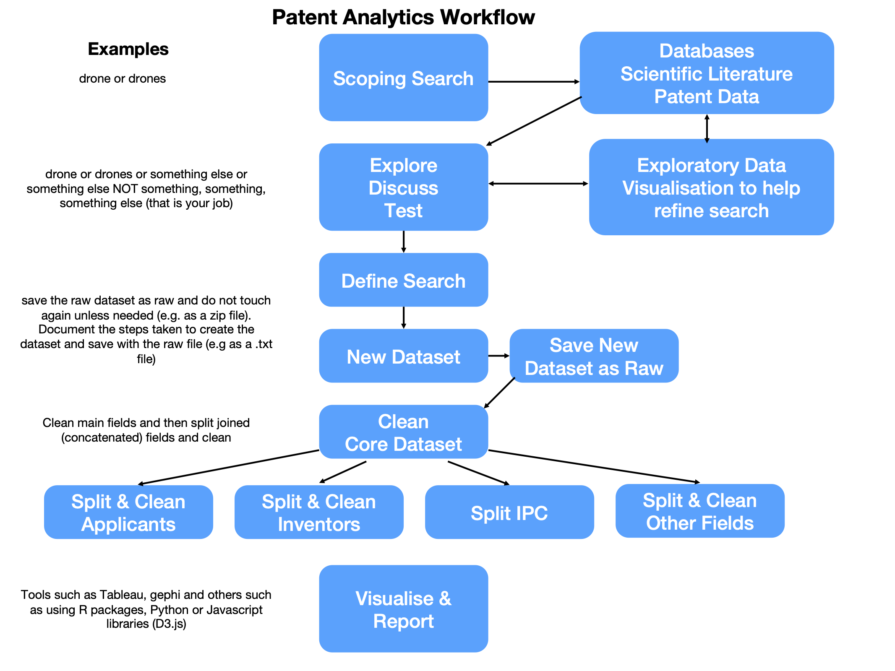

# The Patent Analytics Workflow

When starting out in patent analytics it is tempting to think of patent analytics as involving three steps:

- Searching a database
- Downloading some data in Excel format
- Presenting the data to your audience

In reality, there are considerable number of steps involved in effective patent analytics. It is better to think of patent analytics in terms of a patent analytics workflow consisting of multiple steps. Some of those steps will be purely exploratory in nature and will help you to refine your results. Others will focus on preparing data for visualisation using a range of different tools. 

One very common error is to imagine that data downloaded from a search of a patent database is ready to present to an audience. It is merely the start of the patent analytics process. 

In 2017 Paul Oldham and Irene Kitsara were presenting at a patent analytics training workshop at the Intellectual Property Office of the Philippines (IPOPHL) when we realised that everyone would find this much easier to follow if there was a diagram showing the steps. This diagram is presented in Figure \@ref(fig:workflow).

```{r workflow, echo=FALSE, fig.align='center', fig.cap="The Patent Analytics Workflow"}

```

This workflow has proven to be very robust as a practical guide to actually conducting patent analytics. We will go through the main steps below. The remainder of the Manual itself is organised to provide a practical introduction to tools for carrying out this workflow. We will briefly discuss each component of the workflow. 

## Scoping Search

Patent analytics starts by conducting a scoping search. A scoping search can be carried out using either a database of the scientific literature, a patent database or both.

The aim of a scoping search is to get a basic grip on the subject matter at hand. In this case, and at various points in this Manual, we will be focusing on drone technology. For the purpose of the scoping search we start with the simple term drone or drones as the search terms. 

At this stage we are carrying out a basic inspection of the results for our search terms and trying to gain insights into how we might want to refine our search terms. For example the term "drone" has multiple uses in the scientific and the patent literature. We want to identify what those uses are. 

## Exploratory data visualisation

We will normally want to refine our search terms based on our inspection of the results. For example, for drone technology we will probably want to include the terms "Unmanned Aerial Vehicle" and a host of other terms. We might also want to identify uses of these terms that we want to exclude and invite the reader to contemplate other uses of the term "drone" that they think might meet fit the bill here.

Data visualisation is often seen as the end result of the analytics process. However, it is also important for out ability to understand our data and refine our approach at the very beginning of the patent analytics process. For example, we might want to visualise trends in the publication of patent data or try to identify clusters or themes in the data. A common approach in patent analysis would be to divide up the data using the International Patent Classification or Cooperative Patent Classification to test whether there are existing classification codes (like library codes or MeSH codes in medical literature) that quite accurately describe our data. 

It is important to emphasise that this is an _iterative process_. Depending on the size of the data and the complexity of the topic you may run multiple experimental searches. You may also end up deciding to create multiple thematic datasets under your topic, particularly where the terms are very noisy (lots of unwanted results) or where some terms are so dominant that other areas of interest get lost. 

As you move forward in defining your search query and exploring the data it is a very good idea to write down your observations as you go. This could be in a simple text or word document that you save with the exploratory data. The important point here being that you create a record that 'future you' will be able to follow in reconstructing what you did and why you did it. Just as importantly, you will be able to explain what you did to other people. This is particularly important if you are working as part of a team or if your work involves multiple groups of people. 

## Defined Search

One you have passed through the exploratory stage and defined your search you are in a position to move forward and retrieve your data using the query that you have defined. 

## Core Dataset

When you run your new query, the result will be a new dataset that you will typically download from a database provider. _Do not edit this dataset!_ because you may well regret it later. 

Best practice with your new dataset is to archive a copy of it and save it with the label `_raw` somewhere in the name. An easy option for this, if not already in a .zip file, is to compress the file as .zip (or .gz or .bzip for those familiar with working with data) to preserve the original record. 

It is also good practice, as mentioned above, to write down the details of the dataset in a text file that you store with that data. 

One common problem when working with data is naming things. It is a good idea to identify some conventions that work for you and, if working in a team, for your colleagues. For example, Paul Oldham uses the following conventions when naming file. 

<source>_<searchname>_<type>_<date>_<other>

An example of implementing this would be:

- lens_drones_ft_20211220_raw (search of the lens drones full text = ft. on the <date>. raw file.)

- lens_drones_tac_20211220_raw (search of the lens drones titles, abstracts and claims = tac. on the <date>. raw file.)

If you are creating datasets from searches of both the scientific literature and the patent literature you will want to ensure that you can separate the two out. You will probably want to do this by saving the data in separate folders but it is still very helpful to specify this in the file name. Examples could be:

- lit_lens_drones_ft_20211220_raw.zip
- pat_lens_drones_ft_20211220_raw.zip

In deciding on the conventions that you will use for documenting your files there are three important points. 

1. Computer systems only allow file sizes of certain lengths and do not allow special characters (?/\ etc) and may struggle with spaces (tip: use underscores). Don't make the file sizes too long. 
2. Find a system that works for you and stick with it. You will thank yourself later on. 
3. File names are intended to allow you to recognise the data at a glance. Record the query and any other useful information in a separate text file that is stored with the data. That way `future you` will be able to come back years later and have a good possibility of understanding what you were doing.

The basic naming of files really starts to matter at the next stage of the analysis process.

## Cleaning the Core Dataset

In patent analytics the data is normally delivered in one of three basic formats:

- comma separated (.csv) or tab separated (.tsv) files where the separator is used to distinguished between columns. 
- Excel format
- JSON format (javascript object notation language)

The majority of the time these tables contain columns with concatenated information. For example, the patent applicants table might contain an entry that looks like this:

`Google;Alphabet;Smith, Amy`

In practice, columns in a data table that are commonly concatenated in this way are:

- international patent classification (also cooperative patent classification);
- applicants
- inventors

However, other fields such as dates, identifiers and other columns may also be concatenated.

Patent data is also available in other data formats, notably XML and JSON. These are formats that are designed to be read by computers rather than humans and consist of lists of nested data. Relevant items of interest in these lists (such as applicants) need to be identified and then extracted. 

The concatenation of multiple observations in one cell in a data table and the nesting of lists in XML and JSON are distinct. However, for the data scientist and patent analyst, what matters is that _we cannot perform accurate analysis on this data without splitting it up into separate tables_.

### Splitting Data

Splitting data is normally performed by identifying the separator in the column of interest, such as patent applicants, and then breaking the data into new rows, one per name, while keeping the document identifier (e.g. the patent publication number).

The splitting of data in this was is tricky to do in tools such as Excel. However, it is made very easy with tools such as Open Refine as discussed in Chapter 10 of this Manual. 

### Cleaning Data

One issue when working with data on scientific publications and patent data is a need to clean up noisy data. For example, if we imagine that we have a table with patent applicant names we might observe the following:

> Google
Google Inc.
Google Inc.,
Google Inc

In this case we have variations of a company name (known as splits) where minor variations of a name involving terms such as Inc and punctuation are treated as distinct entities. 

A second type of problem involves data containing _the same name for distinct entities_ (known as lumps). This is a particular problem when we deal with person names such as authors or inventors. Here are some common examples for author and inventor names.

> Wang Wei, 2000
Smith John, 500
Garcia Carlos, 350

The difficulty presented by lumps of names is that records are grouped together that belong to distinct persons. This is actually a more difficult issue to address than the splits problem because we need to access other information (institution names, co-authors or co-inventors or topic information) in order to determine whether the person is one or multiple people. 

Probably the best of the available free tools for dealing with these kinds of issues is Open Refine as discussed in Chapter 10. Open Refine is a programme that runs in a browser and extension packages have also been written for R and Python by members of the community. 

Other types of data cleaning can include the transformation of dates into useful formats, such as extracting the year from `2021-12-25` or separating or combining classification codes such as C12Q1/68 into versions that are useful. For example, International Patent Classification codes (also know as symbols) are ordered into a hierarchy as follows.

Section: C
Class: 12
Subclass: Q
Group: 1
Subgroup: 68

Code C12Q1/68 is a subgroup that describes `Measuring or testing processes involving nucleic acids` (in other words DNA sequences). However, we will commonly want summarise this data for display at a higher level in the hierarchy than the subgroup level. 

Most of the time, we will want to summarise the data at the subclass level e.g. C12Q. The full description of C12Q in the International Patent Classification is as follows:

> "MEASURING OR TESTING PROCESSES INVOLVING ENZYMES, NUCLEIC ACIDS OR MICROORGANISMS (immunoassay G01N33/53); COMPOSITIONS OR TEST PAPERS THEREFOR; PROCESSES OF PREPARING SUCH COMPOSITIONS; CONDITION-RESPONSIVE CONTROL IN MICROBIOLOGICAL OR ENZYMOLOGICAL PROCESSES"

In viewing this we can easily appreciate that if we were to display this in a table or a graphic it is way too long. For the purpose of display we would therefore want to edit this to something that is more human readable and easier to display such as:

> "Measuring/Testing with enzymes or nucleic acids"

The International Patent Classification (IPC) consists of over xxx classification codes. We will therefore spend a lot of time editing the text of the classification each time that we want to display the information. 

In practice, it will be much more efficient to create a single table containing the abbreviated terms that we can _join_ to the IPC table for our dataset. We will not cover table joins in this Manual but you can learn about them in introductory data science handbooks such as [R for Data Science](https://r4ds.had.co.nz/).

In other cases we might want to use a pre-existing thesaurus of company or inventor names that we have cleaned to help us clean up the entries in a table before moving to a display. 

Increasingly, patent analytics will involve the use of machine learning models to extract information from texts such as concepts, chemical names, species names, country or place names and other terms of interest. This opens up the possibility of linking the tables produced in our workflow with other types of data that we can then display to our audience. 

We will cover some of these additional options in this Manual with the remainder addressed in the more advanced [WIPO Patent Analytics Handbook](https://wipo-analytics.github.io/handbook/).

## Visualise & Report

The final major step in the patent analytics workflow is to visualise the data and report in a way that is suitable and targeted to your specific audience. 

In the Manual we will focus on two popular forms of data visualisation: 

- Dashboards using Tableau Public (Chapter 11)
- Networks using Gephi (Chapter 12)

We then turn our attention to other tools for visualisation that provide a gentle introduction to the R programming language to visualise data using:

- plotly
- infographics

The Manual requires no prior knowledge of the use of programming languages such as R or Python. However, the use of programming languages opens up a world of possibilities for the patent analyst. 

## Conclusion

Patent analytics is an iterative process that involves a number of clearly defined step ranging from initial scoping searches and exploratory data analysis through to the definition of a core dataset, splitting a core dataset into sub-tables, cleaning data, joining data with other data sources and finally, visualising data and reporting. 

We will implement the main elements of this workflow as we move through the different chapters in the Manual. Each chapter is designed to provide a practical rather than theoretical guide to patent analytics. 
