# (PART) Obtaining Patent Data {.unnumbered}

## Databases

### Introduction

This chapter provides a quick overview of some of the main sources of free patent data. It is intended for quick reference and points to some free tools for accessing patent databases that you may not be familiar with.

It goes without saying that getting access to patent data in the first place is fundamental to patent analysis. There are quite a few free services out there and we will highlight some of the important ones. Most free sources have particular strengths or weaknesses such as the number of records that can be downloaded, the data fields that can be queried, the format the data comes back in or how `clean` data is in terms of the hours required to prepare for analysis. We won't go into all of the details that but will provide some basic pointers.

## The Databases

### [The Lens](https://www.lens.org/lens/)

Originally known as the Patent Lens this is a very well designed site that provides combined access to data on hundreds of millions of scientific publications and worldwide patent collections Figure \@ref(fig:fig1lens). Originally free for all users, the services are increasingly being split between non-commercial and commercial users in order to generate funds for the services.

Compared with other service providers, the Lens is particularly strong in linking the scientific and patent literature through citations. The Lens also stands out for the number of records that can be downloaded (50,000) compared with other services, for its rapid visualisation tools, new application programming and bulk download services (paid) and genetic sequence data (free and paid).

It is possible to search the title, abstract, description and claims of patent documents and create and share data in collections. As of 2021 it is possible to download 50,000 records at a time, including the titles, abstracts and claims of patent documents. As far as we are aware no other patent database offers this level of rapid access for patent analytics purposes.

```{r fig1lens, echo=FALSE, fig.align='center', fig.cap="The Lens Home Page"}
knitr::include_graphics("images/databases/lens2/fig1_lens_front.png")

```

### [Patentscope](https://patentscope.wipo.int/search/en/search.jsf)

The WIPO Patentscope database provides access to over 2.4 million Patent Cooperation Treaty applications and over 99 million patent documents. including downloads of a selection of fields (up to 10,000 records), a very useful [search expansion translation tool](https://patentscope.wipo.int/search/en/clir/clir.jsf?new=true), and [translation](https://www3.wipo.int/patentscope/translate/translate.jsf?interfaceLanguage=en) (Figure \@ref(fig:patentscopefront).

For readers in South East Asia (ASEAN) it is important to note that the national collections of Brunei Darussalam, Cambodia, Philippines, Indonesia, Malaysia and Thailand and Viet Nam are available in Patentscope. This overcomes a limitation in access to these national collections across different databases. 

```{r patentscopefront, echo=FALSE, fig.align='center', fig.cap="The Patentscope Home Page"}
knitr::include_graphics("images/databases/patentscope/patentscope_front.png")
```

Search results for drone technology on Patentscope Figure \@ref(fig:fig2patentscope).

```{r fig2patentscope, echo=FALSE, fig.align='center', fig.cap="Search Results from Patentscope"}
knitr::include_graphics("images/databases/patentscope/fig2_patentscope.png")
```

Obtaining [sequence data from Patentscope](https://patentscope.wipo.int/search/en/sequences.jsf). Note that this rapidly becomes gigabytes of data Figure \@ref(fig:fig3patentscope).

```{r fig3patentscope, echo=FALSE, fig.align='center', fig.cap="Patentscope Sequence Listings with Bulk Download available over ftp"}
knitr::include_graphics("images/databases/patentscope/fig3_patentscope.png")
```

Perhaps less well known is [WIPO Pearl](https://wipopearl.wipo.int/en/linguistic) , see Figure \@ref(fig:fig4wipopearl). This provides access to powerful human curated mappings of search terms across multiple languages and is particularly important for developing detailed searches in specific domains and for searching across jurisdictions.

```{r fig4wipopearl, echo=FALSE, fig.align='center', fig.cap="WIPO Pearl Cross Language Terms"}
knitr::include_graphics("images/databases/patentscope/fig4_wipopearl.png")
```

In Figure \@ref(fig:fig4wipopearl) we have searched for the term drone and exposed related terms within and across languages in patent data. In tFigure \@ref(fig:fig5wipopearl) below we use concept match search focusing on airborne drones to reveal closely related concepts in patent data.

```{r fig5wipopearl, echo=FALSE, fig.align='center', fig.cap="WIPO Pearl Patent Concept Map"}
knitr::include_graphics("images/databases/patentscope/fig5_wipopearl.png")
```

### [espacenet](http://worldwide.espacenet.com/?locale=en_EP)

Probably the best known free patent database from the European Patent Office. espacenet provides free access to over 130 million patent documents Figure \@ref(fig:fig1espacenet). 

```{r fig1espacenet, echo=FALSE, fig.align='center', fig.cap="espacenet home page"}
knitr::include_graphics("images/databases/espacenet/fig2espacenet.png")
```

The espacent search interface has been updated since the first edition of this manual and now includes a greater range of search options and tooltips (Figure \@ref(fig:fig2espacenet).

```{r fig2espacenet, echo=FALSE, fig.align='center', fig.cap="espacenet advanced search features filters and tool tips"}
knitr::include_graphics("images/databases/espacenet/fig2espacenet.png")
```

### [LATIPAT](http://lp.espacenet.com)

For readers in Latin America (or Spain & Portugal) LATIPAT Figure \@ref(fig:fig3latipat) is a very useful resource 

```{r fig3latipat, echo=FALSE, fig.align='center', fig.cap="LATIPAT for patent texts in Spanish and Portugese"}
knitr::include_graphics("images/databases/espacenet/fig3latipat.png")
```

### [EPO Open Patent Services](http://www.epo.org/searching/free/ops.html)

Access patent data through the EPO Application Programming Interface (API) free of charge (Figure \@ref(fig:fig4ops). Requires programming knowledge.

```{r fig4ops, echo=FALSE, fig.align='center', fig.cap="EPO Open Patent Services for programmatic access to EPO data"}
knitr::include_graphics("images/databases/espacenet/fig4ops.png")
```

<!---The developer portal allows you to test your API queries and is recommended.--->
<!---TO DO. Add more details on the service and also show the developers area. Very unclear who--->
<!------>

### [USPTO Patents View](http://www.patentsview.org/web/)

The [USPTO main database search page](http://patft.uspto.gov) can reasonably be described as well... old. In 2016 the USPTO team initiated an [Open Data and Mobility initiative](http://www.uspto.gov/learning-and-resources/open-data-and-mobility) that opens up USPTO patent and trademark data. The new [Open Date Portal](https://developer.uspto.gov) is still in Beta but provides an insight into things to come.

As part of the shift to open data the USPTO has established an external [Patents View](http://www.patentsview.org/web/) for free searches and [bulk downloads](http://www.patentsview.org/download/). If simple searching does not meet your needs, or the bulk options are too overwhelming, then [the new JSON API service](http://www.patentsview.org/api/doc.html) is likely to meet your needs. The services are still in beta but this is a very exciting development for those who need greater levels of access to patent data or access to specific data fields.

### [Google Patents](http://www.google.com/patents)

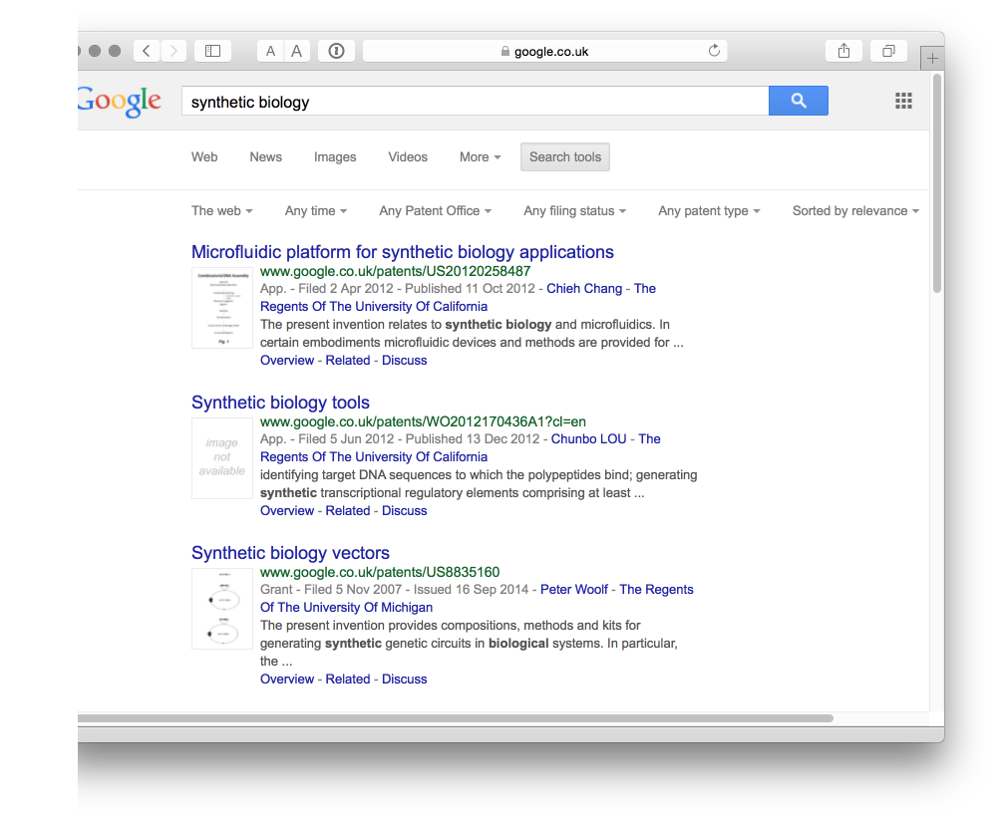

The [Google Patent Search API](https://developers.google.com/patent-search/terms) has been deprecated. Access through the Google Custom Search API with the API flag for patents [reported](http://stackoverflow.com/questions/15028166/python-module-for-searching-patent-databases-ie-uspto-or-epo) to be `&tbm=pts` with example code for using the API in Python.

In the free version of the Google Custom Search API data retrieval is limited and the patent field headings are unclear (that is they use non-standard names). For free patent analytics, Google Custom Search is presently of very limited use.

### [Google Prior Art Finder](https://www.google.com/patents/related)

The Google Prior Art Finder is a relatively recent development that allows you to enter search terms or patent numbers and to view and export results.

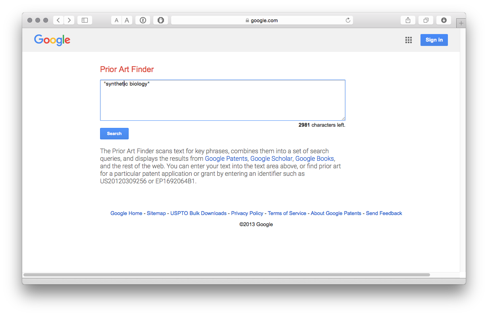

The results include a Top Ten and are broken down into sections including Google Scholar, Patents etc.

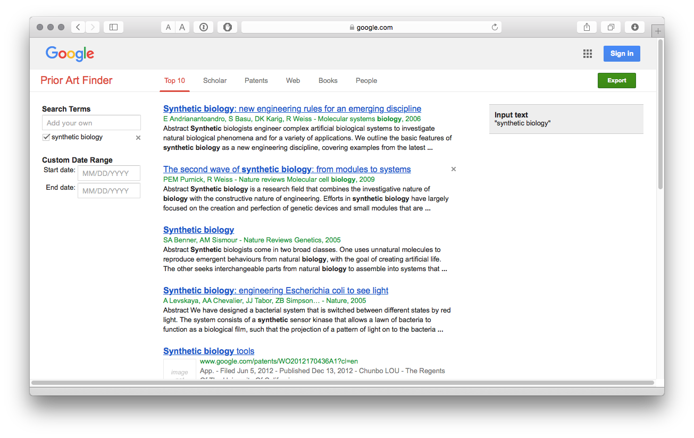

The Export button will export the top ten results for each section in a .csv file.

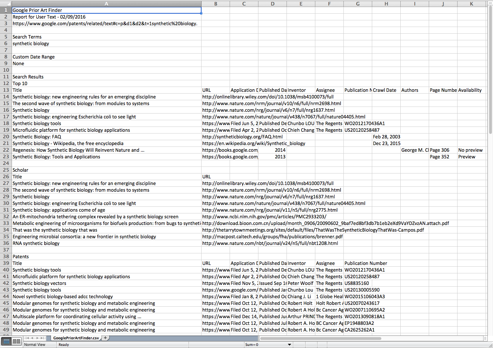

It is possible to load more results for a section (e.g. see More Patent Results at the bottom of the results) and then export them (e.g. 20 patent documents rather than 10). In a test we managed to export 140 patent results but this could rapidly become laborious. An additional issue is that the data will need transposing. At the time of writing we had not identified an API route to Prior Art Finder.

### [Google USPTO Bulk download](https://www.google.com/googlebooks/uspto.html)

The [USPTO patent databases](http://patft.uspto.gov) may be archaic but you can download the entire US collection from the [Google USPTO Bulk download service](https://www.google.com/googlebooks/uspto-patents.html).

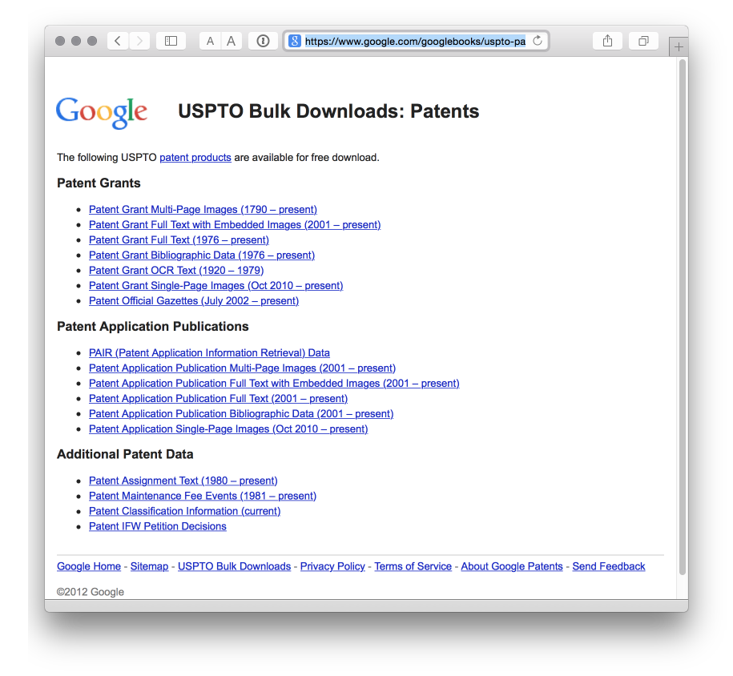

It is a fantastic service, and an example to patent offices everywhere on freeing up patent data. If you have a good broadband connection and the hard drive space, it is quite good fun to suddenly have access to millions of patent records. The authors used the service to text mine the collection for millions of biological species names as reported [here](http://journals.plos.org/plosone/article?id=10.1371/journal.pone.0078737).

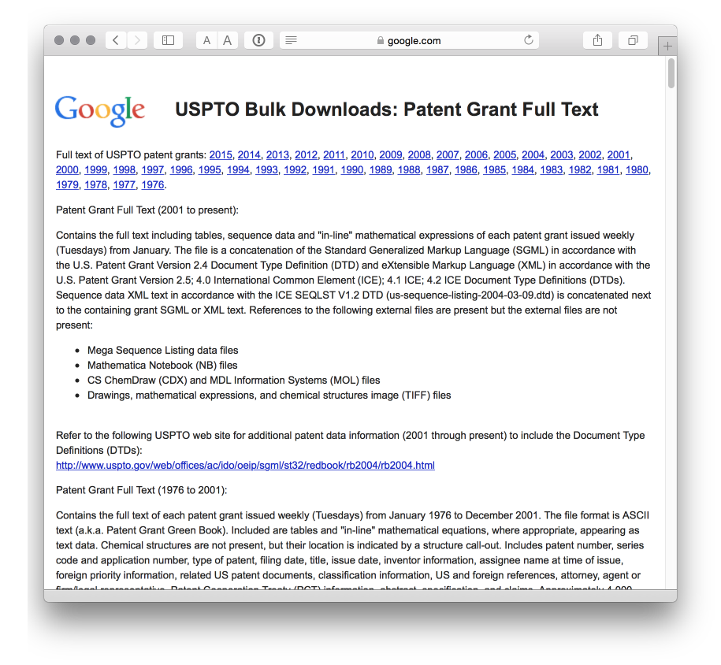

However, one important issue to note is that the XML delimiting individual documents is not always well demarcated. This means that any code that will work for one bulk set of files may fail on another set. While it is possible to address this, be prepared to spend time working on this and/or seek assistance from a professional programmer. For an insight into these issues see this [Stackoverflow discussion](http://stackoverflow.com/questions/25107557/parseing-xml-by-r-always-return-xml-declaration-error) on parsing the data in R.

### [Free Patents Online](http://www.freepatentsonline.com)

Sign up for a free account for enhanced access and to save and download data. It has been around quite a while now and while the download options are limited we rather like it.


### [DEPATISnet](http://www.dpma.de/english/service/e-services/depatisnet/)

We are not covering national databases. However, the patent database of the German Patent and Trademark Office struck us as potentially very useful. It allows for searches in English and German and has extensive coverage of international patent data, including the China, EP, US and PCT collections. The coverage details are [here](https://depatisnet.dpma.de/DepatisNet/depatisnet?action=datenbestand). Worth experimenting with.

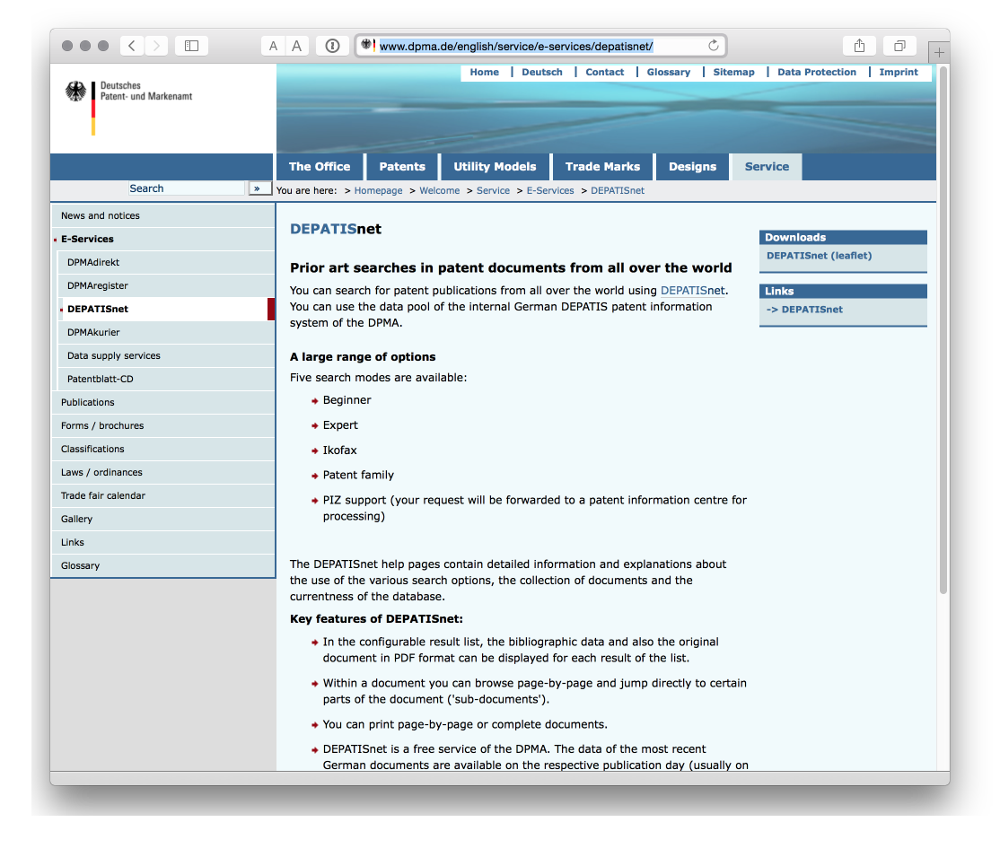

### [OECD Patent Databases](http://www.oecd.org/sti/inno/oecdpatentdatabases.htm)

One that is more for patent statisticians. The OECD has invested a lot of effort into developing patent indicators and resources including citations, the Harmonised Applicants names database [HAN database](http://www.oecd.org/sti/inno/43846611.pdf), mapping through the [REGPAT database](http://www.oecd.org/sti/inno/40794372.pdf) among other resources that are available free of charge.

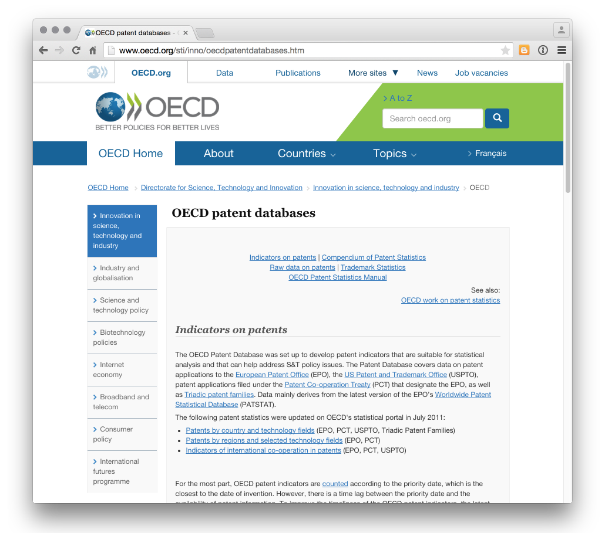

Along the same lines the US National Bureau of Economic Research [NBER US Patent Citations Data File](http://www.nber.org/patents/) is an important resource.

### [EPO World Patent Statistical Database](https://www.epo.org/searching-for-patents/business/patstat.html)

The most important database for statistical use is the EPO World Patent Statistical Database (PATSTAT) and contains around 90 million records. PATSTAT is not free and costs 1250 Euro for a year (two editions) or 630 Euro for a single edition. The main barrier to using PATSTAT is the need to run and maintain a +200 Gigabyte database. However, there is also an online version of PATSTAT that is free for the first two months if you wish to try it by signing up for the trial (knowledge of SQL required).

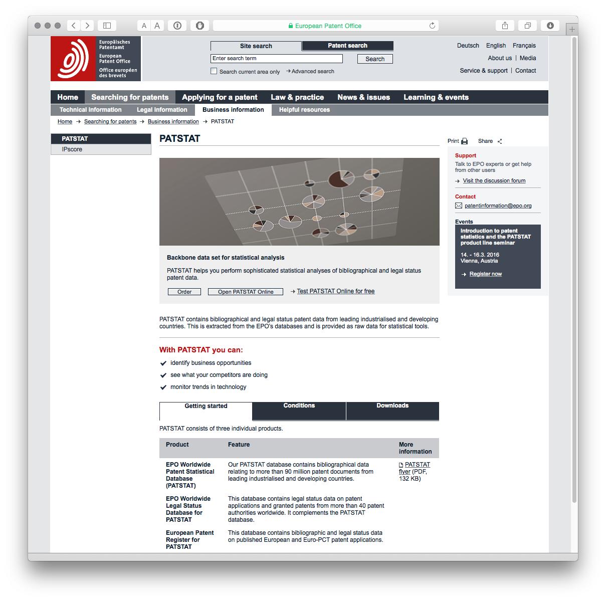

For users seeking to load PATSTAT into a MySQL database Simone Mainardi provides the following [code on Github](https://github.com/simonemainardi/load_patstat).

### Other data sources

A number of companies provide access to patent data, typically with tiered access depending on your needs and budget. Examples include [Thomson Innovation](https://www.thomsoninnovation.com/login), [Questel Orbit](https://www.questel.com/index.php/en/), [STN](http://www.stn-international.de/index.php?id=123), and [PatBase](https://www.patbase.com/login.asp). We will not be focusing on these services but we will look at the use of data tools to work with data from services such as Thomson Innovation.

For more information on free and commercial data providers try the excellent [Patent Information User Group](http://www.piug.org) and its list of [Patent Databases](http://wiki.piug.org/display/PIUG/Patent+Databases) from Tom Wolff and Robert Austin.

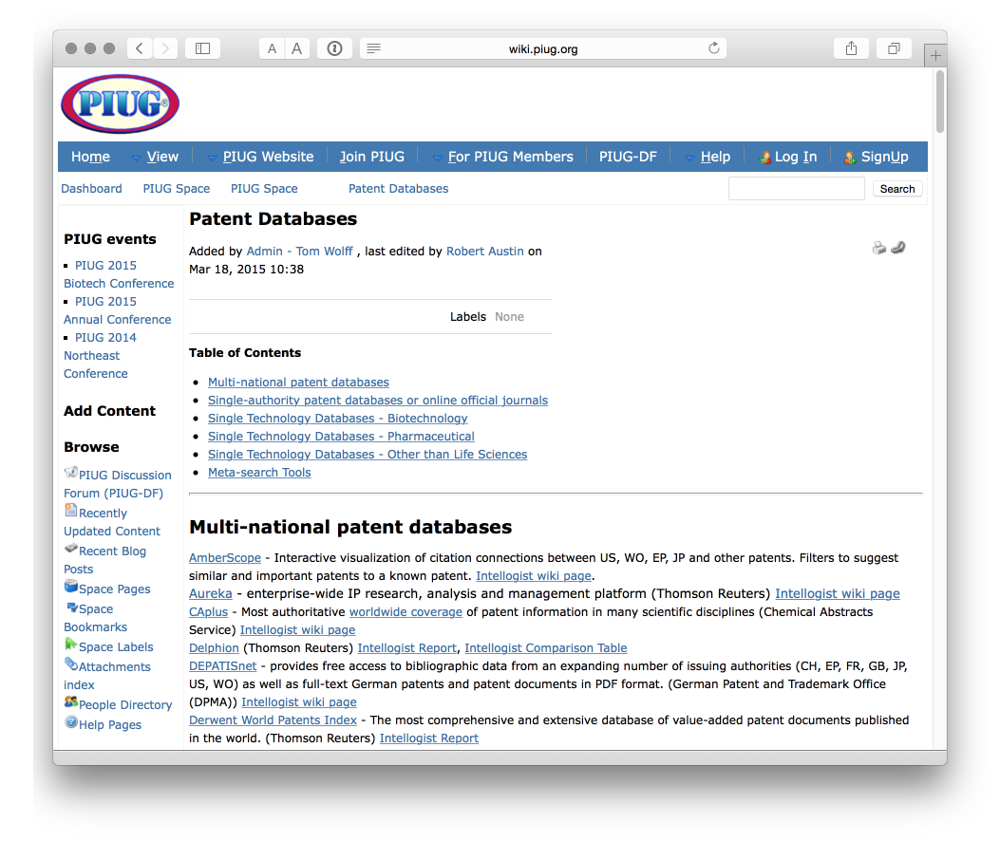

Also worth mentioning is the Landon IP [Intellogist](http://www.intellogist.com/wiki/Main_Page) blog which maintains [Search System Reports](http://www.intellogist.com/wiki/Category:Intellogist_Reports)


\#\#Tools for Accessing Patent Data

In closing this chapter we will highlight a couple of tools for accessing patent data, typically using APIs and Python. We will come back to this later and are working to try this approach in R.

### [Patent2Net](https://github.com/Patent2net/Patent2Net) in Python

A Python tool to access and process the data from the European Patent Office OPS service.

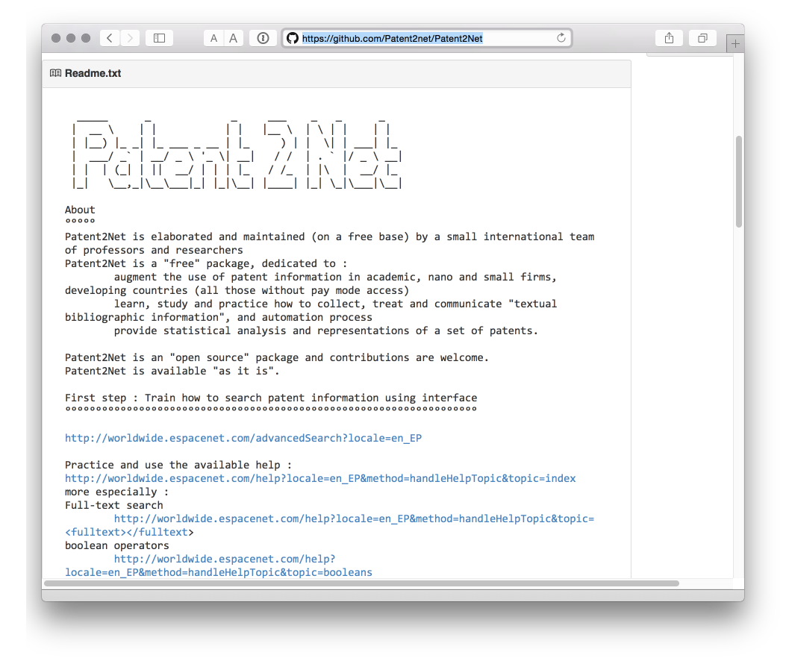

### [Python EPO OPS Client](https://github.com/55minutes/python-epo-ops-client) by Gsong

A Python client for OPS access developed by Gsong and freely available on GitHub. Used in Patent2Net above.

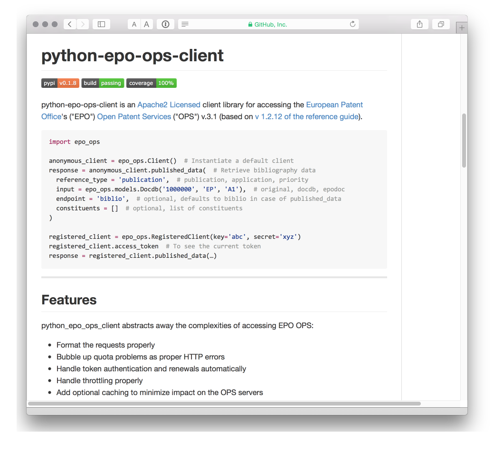

### [Fung Institute Patent Server](https://github.com/funginstitute/patentserver) for USPTO data in JSON

Researchers at the Fung Institute have also been active in developing open source resources for accessing and working with patent data. We highlight `patentserver` but it is worth checking out other resources in the repository such as [patentprocessor](https://github.com/funginstitute), a set of Python scripts for processing USPTO bulk download data. Note that development of these tools no longer appears to be active.

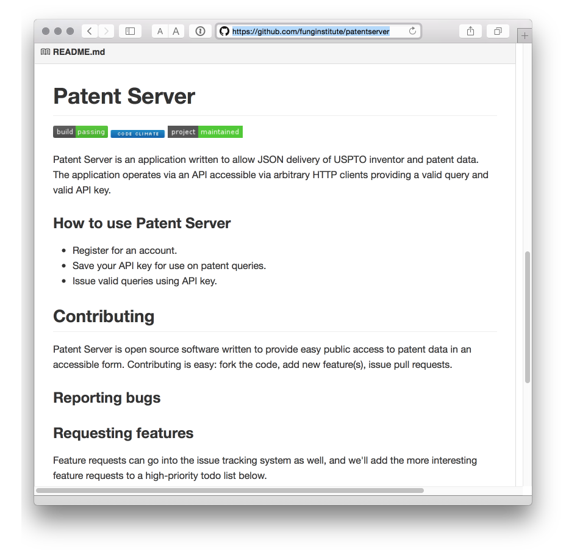

\#\#Round Up

One problem confronting patent analysts is access to data in a form that is suitable for more detailed analysis. Typically this involves hundreds or many thousands of records. Recent years have increasingly opened up patent data through the ability to download 1,000 or 10,000 records at a time. However, access to downloads of titles, abstracts and claims or descriptions and full text remains limited when this is what is needed. Patent offices such as the USPTO have taken a leading role in making bulk patent data available and this is very much to be welcomed for those working on patent analytics. However, it is reasonable to say that the present situation is one of improvements in access (through Patentscope, the Lens and the EPO OPS service) but not quite in the quantitities or with the data fields patent analysts would like.
