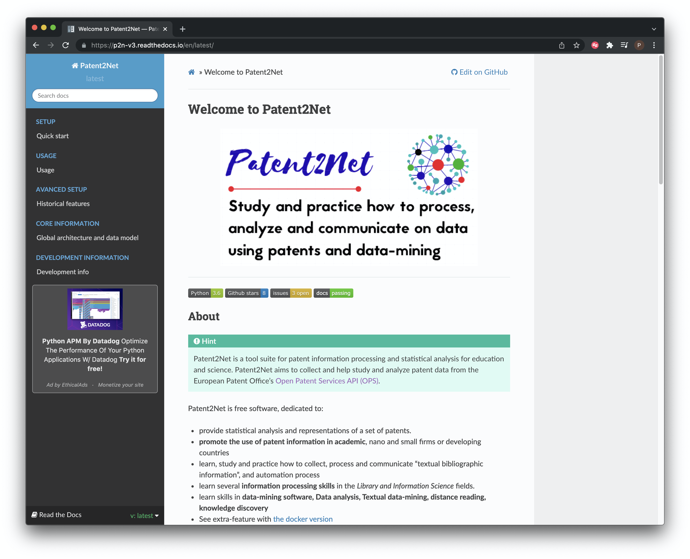
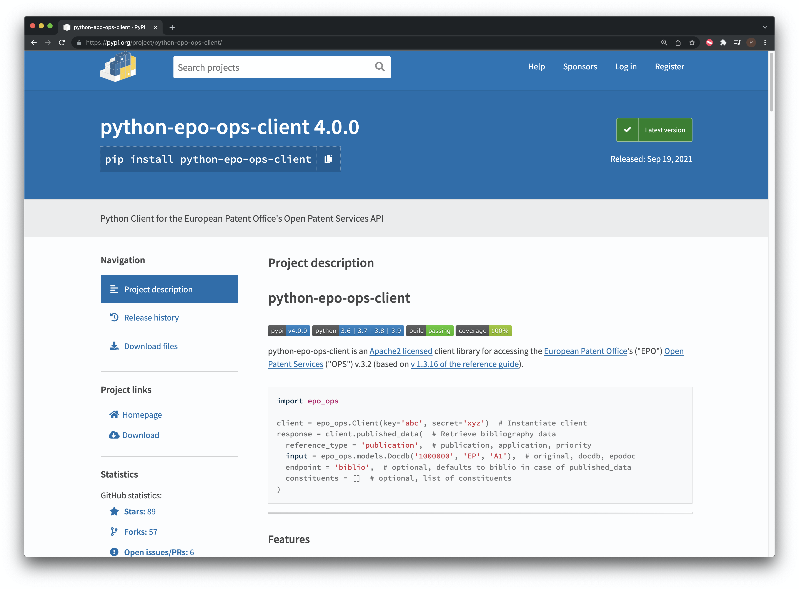

# (PART) Obtaining Patent Data {-}
<!--- last spell checked 2022-09-29--->
# Databases

### Introduction

This chapter provides a quick overview of some of the main sources of free patent data. It is intended for quick reference and points to some free tools for accessing patent databases that you may not be familiar with.

It goes without saying that getting access to patent data in the first place is fundamental to patent analysis. There are quite a few free services out there and we will highlight some of the important ones. Most free sources have particular strengths or weaknesses such as the number of records that can be downloaded, the data fields that can be queried, the format the data comes back in or how `clean` data is in terms of the hours required to prepare for analysis. We won't go into all of the details that but will provide some basic pointers.

## The Databases

### [The Lens](https://www.lens.org/lens/)

Originally known as the Patent Lens this is a very well designed site that provides combined access to data on hundreds of millions of scientific publications and worldwide patent collections Figure \@ref(fig:fig1lens). Originally free for all users, the services are increasingly being split between non-commercial and commercial users in order to generate funds for the services. However, the Lens has adopted an equitable access policy ([LEAP](https://www.lens.org/lens/collective-action/leap)) that means that ability to pay should not be an obstacle to access. 

Compared with other service providers, the Lens is particularly strong in linking the scientific and patent literature through citations. The Lens also stands out for the number of records that can be downloaded (50,000) compared with other services, for its rapid visualisation tools, new application programming and bulk download services (paid) and genetic sequence data (free and paid).

It is possible to search the title, abstract, description and claims of patent documents and create and share data in collections. As of 2021 it is possible to download 50,000 records at a time, including the titles, abstracts and claims of patent documents. As far as we are aware no other patent database offers this level of rapid access for patent analytics purposes.

```{r fig1lens, echo=FALSE, fig.align='center', fig.cap="The Lens Home Page"}
knitr::include_graphics("images/databases/lens2/fig1_lens_front.png")

```

### [Patentscope](https://patentscope.wipo.int/search/en/search.jsf)

The WIPO Patentscope database provides access to over 2.4 million Patent Cooperation Treaty applications and over 99 million patent documents. including downloads of a selection of fields (up to 10,000 records), a very useful [search expansion translation tool](https://patentscope.wipo.int/search/en/clir/clir.jsf?new=true), and [translation](https://www3.wipo.int/patentscope/translate/translate.jsf?interfaceLanguage=en) (Figure \@ref(fig:patentscopefront).

For readers in South East Asia (ASEAN) it is important to note that the national collections of Brunei Darussalam, Cambodia, Philippines, Indonesia, Malaysia and Thailand and Viet Nam are available in Patentscope. This overcomes a limitation in access to these national collections across different databases. 

```{r patentscopefront, echo=FALSE, fig.align='center', fig.cap="The Patentscope Home Page"}
knitr::include_graphics("images/databases/patentscope/patentscope_front.png")
```

Search results for drone technology on Patentscope Figure \@ref(fig:fig2patentscope).

```{r fig2patentscope, echo=FALSE, fig.align='center', fig.cap="Search Results from Patentscope"}

```

Obtaining [sequence data from Patentscope](https://patentscope.wipo.int/search/en/sequences.jsf). Note that this rapidly becomes gigabytes of data Figure \@ref(fig:fig3patentscope).

```{r fig3patentscope, echo=FALSE, fig.align='center', fig.cap="Patentscope Sequence Listings with Bulk Download available over ftp"}
knitr::include_graphics("images/databases/patentscope/fig3_patentscope.png")
```

Perhaps less well known is [WIPO Pearl](https://wipopearl.wipo.int/en/linguistic) , see Figure \@ref(fig:fig4wipopearl). This provides access to powerful human curated mappings of search terms across multiple languages and is particularly important for developing detailed searches in specific domains and for searching across jurisdictions.

```{r fig4wipopearl, echo=FALSE, fig.align='center', fig.cap="WIPO Pearl Cross Language Terms"}

```

In Figure \@ref(fig:fig4wipopearl) we have searched for the term drone and exposed related terms within and across languages in patent data. In Figure \@ref(fig:fig5wipopearl) below we use concept match search focusing on airborne drones to reveal closely related concepts in patent data.

```{r fig5wipopearl, echo=FALSE, fig.align='center', fig.cap="WIPO Pearl Patent Concept Map"}
knitr::include_graphics("images/databases/patentscope/fig5_wipopearl.png")
```

### [espacenet](http://worldwide.espacenet.com/?locale=en_EP)

Probably the best known free patent database from the European Patent Office. espacenet provides free access to over 130 million patent documents Figure \@ref(fig:fig1espacenet). 

```{r fig1espacenet, echo=FALSE, fig.align='center', fig.cap="espacenet home page"}

```

The espacent search interface has been updated since the first edition of this manual and now includes a greater range of search options and tooltips (Figure \@ref(fig:fig2espacenet).

```{r fig2espacenet, echo=FALSE, fig.align='center', fig.cap="espacenet advanced search features filters and tool tips"}

```

### [LATIPAT](http://lp.espacenet.com)

For readers in Latin America (or Spain & Portugal) LATIPAT Figure \@ref(fig:fig3latipat) is a very useful resource 

```{r fig3latipat, echo=FALSE, fig.align='center', fig.cap="LATIPAT for patent texts in Spanish and Portugese"}

```

### [EPO Open Patent Services](https://www.epo.org/searching-for-patents/data/web-services/ops.html)

Access patent data through the EPO Application Programming Interface (API) free of charge (Figure \@ref(fig:fig4ops). Requires programming knowledge.

```{r fig4ops, echo=FALSE, fig.align='center', fig.cap="EPO Open Patent Services for programmatic access to EPO data"}

```

<!---The developer portal allows you to test your API queries and is recommended.--->
<!---TO DO. Add more details on the service and also show the developers area. Very unclear who--->
<!------>

### [USPTO Patents View](http://www.patentsview.org)

The [USPTO main database search page](http://patft.uspto.gov) can reasonably be described as well... old. In 2016 the USPTO team initiated an [Open Data and Mobility initiative](http://www.uspto.gov/learning-and-resources/open-data-and-mobility) that opens up USPTO patent and trademark data. The new [Open Date Portal](https://developer.uspto.gov) is still in Beta but provides an insight into things to come.

As part of the shift to open data the USPTO has established an external [Patents View](http://www.patentsview.org) for free searches and [bulk downloads](http://www.patentsview.org/download/). If simple searching does not meet your needs, or the bulk options are too overwhelming, then [the new JSON API service](http://www.patentsview.org/api/doc.html) is likely to meet your needs. The services are still in beta but this is a very exciting development for those who need greater levels of access to patent data or access to specific data fields.

### [Google Patents](http://www.google.com/patents)

<!---updated 2021-12-29--->

```{r googlepatents, echo=FALSE, fig.align='center', fig.cap="Google Patents"}

```

The [Google Patent Search API](https://developers.google.com/patent-search/terms) has been deprecated. Access through the Google Custom Search API with the API flag for patents [reported](http://stackoverflow.com/questions/15028166/python-module-for-searching-patent-databases-ie-uspto-or-epo) to be `&tbm=pts` with example code for using the API in Python.

In the free version of the Google Custom Search API data retrieval is limited and the patent field headings are unclear (that is, they use non-standard names). For free patent analytics, Google Custom Search is presently of very limited use.

### [USPTO Bulk Downloads](https://www.google.com/googlebooks/uspto.html)

The [USPTO patent database interface](http://patft.uspto.gov) is archaic. However, a lot has been happening at the USPTO to make patent data more accessible in a range of formats to enable wider use. 

For patent analytics we recommend the [PatentsView API](https://patentsview.org/apis/api-endpoints) for regular lightweight use and the [PatentsView Data Download](https://patentsview.org/download/data-download-tables) for heavier duty users. The PatentsView Data Download is an excellent resource because it offers the complete US patent collection in data tables that can easily be joined or text mined. 

In addition to PatentsView the USPTO also offers a bulk download service for the raw html files from the USPTO Patent Gazette. 

```{r usptobulk, echo=FALSE, fig.align='center', fig.cap="USPTO Bulk Patent Data"}

```

It is unclear what exactly you might want to do with this and it could take a lot of work to parse but we include it for the sake of completeness. One possible use would be to check legal status issues such as the payment of payment renewal fees. We suspect that this type of use will be more relevant to companies for whom up to date information is of critical importance. Regular users will probably prefer other sources of the same data even if it is less timely. 


### [Free Patents Online](http://www.freepatentsonline.com)

Sign up for a free account for enhanced access and to save and download data. It has been around quite a while now and while the download options are limited we rather like it.

```{r freepatentsonline, echo=FALSE, fig.align='center', fig.cap="Free Patents Online"}

```

### [DEPATISnet](https://www.dpma.de/english/search/depatisnet/index.html)

We are not covering national databases. However, the patent database of the German Patent and Trademark Office struck us as potentially very useful. It allows for searches in English and German and has extensive coverage of international patent data, including the China, EP, US and PCT collections. Worth experimenting with.

```{r depatisnet, echo=FALSE, fig.align='center', fig.cap="German Patent and Trademark Office Database"}

```

### [OECD Patent Databases & Resources](https://www.oecd.org/sti/inno/intellectual-property-statistics-and-analysis.htm)

One that is more for patent statisticians and particularly important for methodologies and understanding patent data. The OECD has invested a lot of effort in developing patent indicators and resources including citations, the Harmonised Applicants names database _HAN database_ and mapping through the _REGPAT database_ among other resources that are available free of charge. The OECD datasets are linked to PATSTAT and are accessible free of charge by filling out a [short form](https://forms.office.com/r/1tUjVJUdu6).

```{r oecd, echo=FALSE, fig.align='center', fig.cap="The OECD IP Portal"}

```

Along the same lines the US National Bureau of Economic Research [NBER US Patent Citations Data File](http://www.nber.org/patents/) is an important resource. NBER patent data resources are accessible as part of the suite of data at [PatentsView](https://patentsview.org/download/data-download-tables), notably the NBER patent category and subcategory classification files. 

### [EPO World Patent Statistical Database](https://www.epo.org/searching-for-patents/business/patstat.html)

The most important database for statistical use is the EPO World Patent Statistical Database (PATSTAT) and contains around 90 million records. PATSTAT is not free and costs 1250 Euro for a year (two editions) or 630 Euro for a single edition. The main barrier to using PATSTAT is the need to run and maintain a +200 Gigabyte database. However, there is also an online version of PATSTAT that is free for the first two months if you wish to try it by signing up for the trial (knowledge of SQL required).

```{r patstat, echo=FALSE, fig.align='center', fig.cap="EPO Patstat Portal"}

```

For users seeking to load PATSTAT into a MySQL database Simone Mainardi provides the following [code on Github](https://github.com/simonemainardi/load_patstat) while Gianluca Tarasconi also provides scripts through the [raw patent blog]( https://rawpatentdata.blogspot.com/search/label/patstat). Note that, as a result of the pandemic, members of the patent analytics community may not have posted the latest scripts. However, the PATSTAT team includes 

### Other data sources

A number of companies provide access to patent data, typically with tiered access depending on your needs and budget. Examples include [The Lens](https://www.lens.org/), [Derwent Innovation](https://clarivate.com/derwent/solutions/derwent-innovation/), [PatSnap](https://www.patsnap.com/), [Dimensions](https://www.patsnap.com/), [Questel Orbit](https://www.questel.com/ip-intelligence-software/orbit-intelligence), [STN](http://www.stn-international.de/index.php?id=123), and [PatBase](https://www.patbase.com/login.asp). We will not be focusing on these services but we will look at the use of data tools to work with data from services such as Derwent Innovation.

For more information on free and commercial data providers try the excellent [Patent Information User Group](http://www.piug.org) and its list of [Patent Databases](https://www.piug.org/vendors/#Database_Producers).

```{r piug, echo=FALSE, fig.align='center', fig.cap="Patent Information User Group"}

```


## Tools for Accessing Patent Data

In closing this chapter we will highlight a couple of tools for accessing patent data, typically using APIs and Python. We will come back to this later and are working to try this approach in R.

### [Patent2Net](https://github.com/Patent2net/Patent2Net) in Python

A Python based tool to access and process the data from the European Patent Office OPS service.

```{r patent2net, echo=FALSE, fig.align='center', fig.cap="Patent2Net"}

```
### [Python EPO OPS Client](https://github.com/55minutes/python-epo-ops-client) by Gsong

A Python client for OPS access developed by Gsong and freely available on GitHub. Used in Patent2Net above.

```{r pythonepo, echo=FALSE, fig.align='center', fig.cap="Python Client for the EPO OPS Service"}

```

## Round Up

One problem that has confronted patent analysts for many years is access to data in a form that is suitable for more detailed analysis. In the six years between the creation of the first edition of this Manual and the second edition the situation has changed quite dramatically. On the one hand data providers such as the Lens allow users to download 50,000 records at a time. On the other hand the USPTO through [PatentsView](https://patentsview.org/download/data-download-tables) and the EPO through its [text analysis service](https://www.epo.org/searching-for-patents/data/bulk-data-sets/text-analytics.html) have made access to patent full texts quite straightforward for those who are prepared to invest some of their time in acquiring programming skills. As patent data becomes more readily available for analysis attention is inevitably turning to topics such as machine learning to work with data at scale, such as the open source [PatCit initiative](https://github.com/cverluise/PatCit) for patent citations. However, before addressing these more complex topics it is important to focus on the fundamentals of patent analytics. In the next two chapters we provide practical walkthroughs with two patent databases before turning to the use of analytics tools. 
