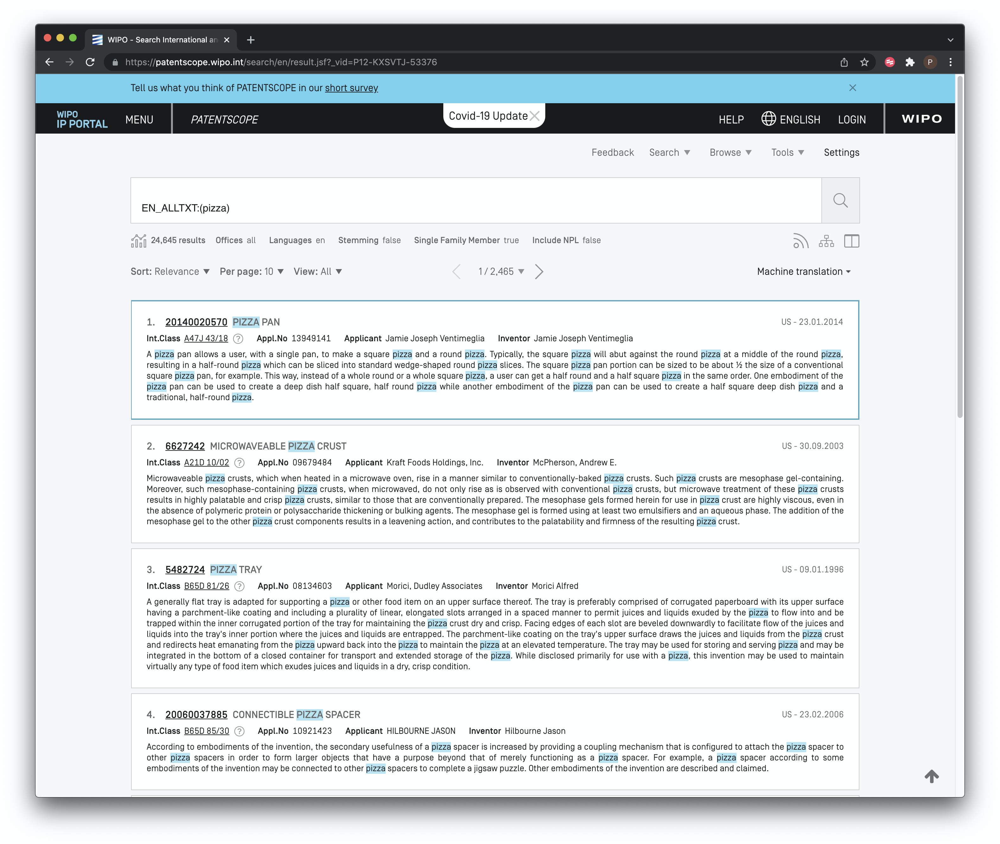

# Patentscope
<!--- last spell checked 2022-09-29--->
## Introduction

[Patentscope](https://patentscope.wipo.int/search/en/search.jsf) is the WIPO public access database. It includes coverage of the Patent Cooperation Treaty applications (administered by WIPO) and a [wide range of other countries](https://patentscope.wipo.int/search/en/help/data_coverage.jsf) including the European Patent Office, USPTO and Japan totalling 100 million patent documents including 4.2 million PCT applications.

```{r psfront, echo=FALSE, fig.align='center', fig.cap="patentscope Home Page"}

```


In this article we cover the basics of using Patentscope to search for and download up to 10,000 records. A detailed [User's Guide](https://www.wipo.int/export/sites/www/patentscope/en/docs/patentscope_user_guide.pdf) provides more details on specific features. A set of detailed [video tutorials](https://patentscope.wipo.int/search/en/help/tutorial.jsf) are also available. Regular updates on new features are provided through the [News Archive](https://www.wipo.int/patentscope/en/news/) as well as [periodic webinars](https://www.wipo.int/meetings/en/topic.jsp?group_id=312). When compared with other free services Patentscope has the following main strengths.

1.  Full text search in the description and claims of PCT applications on the day of publication and patent applications from a wide range of other countries including the United States, Japan, China and the European Patent Office among others.
2.  Download up to 10,000 records
3.  Expand search terms into multiple other languages using `Cross Lingual Expansion` or [CLIR](https://patentscope.wipo.int/search/en/clir/clir.jsf?new=true)
4.  Simple, Advanced and Combined Field searching
5.  Accessible in multiple languages and a [WIPO Translate](https://www.wipo.int/wipo-translate/en/) text function
6.  [Sequence listing downloads](https://patentscope.wipo.int/search/en/sequences.jsf)
7.  Green technologies through the [IPC Green Inventory](https://www.wipo.int/classifications/ipc/green-inventory/home)
8.  Different types of graphical analysis of results lists on the fly using the Options menu.

To get the most out of Patentscope it is a good idea to consult the two detailed guides and the video tutorials:

1.  [Patentscope Search: The User's Guide](http://www.wipo.int/edocs/pubdocs/en/patents/434/wipo_pub_l434_08.pdf).
2.  Patentscope CLIR for the Cross-Lingual Information Retrieval Tool [here](https://patentscope.wipo.int/search/help/en/CLIR_DOC.pdf).
3.  [Patentscope Tips and Tricks Videos](https://patentscope.wipo.int/search/en/help/tipsAndTricks.jsf)

If you would like to download patent or sequence data you will need to register for a free account. To register for a free account go [here](https://www3.wipo.int/authpage/signin.xhtml?goto=https%3A%2F%2Fwww3.wipo.int%3A443%2Fam%2Foauth2%2Fauthorize%3Fclient_id%3Dpatentscope1Prd%26redirect_uri%3Dhttps%253A%252F%252Fpatentscope.wipo.int%252Fsearch%252Fwiposso%252Floggedin%26response_type%3Dcode%26scope%3Dopenid%2Bprofile%2Bemail%26state%3DErpetfWGvGpBt1eJJJk_bSgOj-W47BHMaSCka4hmnVc).

## Collections to Search

Perhaps the best place to start is with the collections we will be searching. Those can be accessed from the search page under [Detailed Coverage information](https://patentscope.wipo.int/search/en/help/data_coverage.jsf).

```{r pscollection, echo=FALSE, fig.align='center', fig.cap="Patent Collections in patentscope"}

```
We can see here that Patentscope provides access to the Patent Cooperation Treaty collection, regional collections such as the ARIPO and the European Patent Office and national collections such as the United States, Japan and Others. The ability to search and retrieve data from the LATIPAT collection will be particularly useful for researchers in Latin America and could be linked to analysis using the espacenet version of [LATIPAT](http://lp.espacenet.com). If you are only interested in particular collections, this is the place to change the settings.

## Simple Search

We can select a range of different fields for search. In this case we have selected full text from the drop down menu for a simple search on the term pizza.


```{r psearch, echo=FALSE, fig.align='center', fig.cap="patentscope: Choose Search Fields"}

```

We then see a raw results set containing 40,923 records with the term pizza somewhere in the document. 

```{r psrawearch, echo=FALSE, fig.align='center', fig.cap="Raw Results of a Full Text Search"}

```
Note that in the menu bar immediately above the results there are a number of options. In particular, all patent offices are selected by default and the language is set to English. However, of particular relevance to use is the entry `Stemming = true` as we see below in Figure \@ref(fig:psstemming).

```{r psstemming, echo=FALSE, fig.align='center', fig.cap="Stemming Terms to their Root"}

```

As the pop-up tip explains, stemming reduces a term to its linguistic root. As such, it expands data capture by including related terms that you may not have initially thought of. Databases often set stemming to True by default and this can be useful for exploring the data and terms you had not considered. However, stemming can also be a source of unexpected and hard to identify noise. For that reason, it is frequently wise to make sure that you turn stemming off, or use "quote" marks around the search term "pizza" to force the database to use the literal term as entered. Figure \@ref(fig:pspizzanostem) shows the result of turning stemming off in patentscope. 

```{r pspizzanostem, echo=FALSE, fig.align='center', fig.cap="Pizza Search Results with Stemming Turned Off"}

```
As we can see in Figure \@ref(fig:pspizzanostem) the effect of removing stemming is to reduce the dataset to 32,790 documents removing 8,133 documents that were added by the stemming process. As this makes clear, depending on your search terms, the impact of stemming on the size of a dataset can be very significant. The important point is to be clear on whether you prefer to maximise data capture by using stemming or to focus on accuracy by requiring precise results for a term or set of terms. In practice, an iterative search strategy might involve:

1. A general search with stemming turned on;
2. Analysis of the results to identify additional search terms of interest and any noisy terms arising from the stemmed root;
3. A precise search that may exclude particular terms or phrases.

The second issue to be aware of is that patent documents in a result set may be duplicates (re-publications) of the same document such as the publication of a patent application and a patent grant. Re-publications of the same document form part of a 'patent family'. A patent family can be defined in a wide variety of ways and patent families are discussed in detail in the [WIPO Patent Analytics Handbook](https://wipo-analytics.github.io/handbook/patents.html#families). The basic principle is that patent documents are related to each other where they share an earlier filing (which may or may not be published) as a parent. For statistical purposes as in the 2009 [OECD Patent Statistics Manual](https://www.oecd.org/sti/inno/oecdpatentstatisticsmanual.htm) the most important document is the priority document (the first document for a claimed invention to be filed anywhere in the world). These documents have no parent and form the basis of patent families for statistical purposes. The members of that family are all children of the priority or first original filing. 

However, different database providers may use their own definitions of patent families (which may or may not be explained). In 2020 patentscope introduced the concept of the Patent Cooperation Treaty family as described in Figure \@ref(fig:psfamily) below. 

```{r psfamily, echo=FALSE, fig.align='center', fig.cap="patentscope Patent Family"}

```

In Figure \@ref(fig:psstemming) for stemming we can see that we also have the option to refine the data to a single family member. Figure \@ref(fig:psrefined) shows the impact of removing stemming and reducing our pizza dataset to a single family member. 

```{r psrefined, echo=FALSE, fig.align='center', fig.cap="Refined Dataset without Stemming and Reduced to One Member Per Family"}

```

We can see in Figure \@ref(fig:psrefined) that by removing stemming and reducing the results to one family member (a PCT document) our original 40,923 results have been reduced to 24,645.

Another feature of patentscope that are worth exploring in the results set is the `Include NPL` menu option. NPL stands for Non Patent Literature and will expand the dataset to include information on scientific publications that are cited in patent documents. 

The menu items on the far right above the result set allow us to save and RSS feed of the results, view a breakdown of results by document section (e.g title = 2499, abstract = claims = 3089 etc) to save our query (if logged in) and to change the document view as we see in Figure \@ref(fig:psview).

```{r psview, echo=FALSE, fig.align='center', fig.cap="Side By Side Result and Document View"}

```

Side by side view is particularly useful for manually reviewing and taking notes on documents of interest.

Many patent databases have a specialist interest in a particular topic. In the case of patentscope particular effort has gone into [Chemical Compounds Search](https://patentscope.wipo.int/search/en/chemc/chemc.jsf) which allows for searches for chemical structures. Finally, as discussed in [Chapter 7](https://wipo-analytics.github.io/manual/databases.html#:~:text=Lens%20Home%20Page-,7.1.2,-Patentscope) above the [WIPO Pearl](https://wipopearl.wipo.int/en/linguistic) tool allows for the identification of concepts to aid in search construction. 

## Downloading Results

In order to download data from patentscope you must be logged in to your account (accounts are free). 

When logged in the results list will display a download button as we see in Figure \@ref(fig:psdownload) with an option to download 1,000 or 10,000 records at at time. 

```{r psdownload, echo=FALSE, fig.align='center', fig.cap="Download patentscope Results"}

```

The data will download as an Excel file with the 10,000 results. In Excel the data looks like this.

```{r psdownloadres, echo=FALSE, fig.align='center', fig.cap="Download patentscope Results"}

```
When compared with other data providers this data is somewhat limited (presumably to limit the size of downloads). However, the hyperlinking of application numbers can be useful for viewing documents of interest. 

We can observe that we have only downloaded 10,000 results for the purpose of illustration. To download larger sets it will be necessary to restrict the searches by data and download the data in chunks. When working with multiple downloads it is a good idea to write down the total number of results and then the results for each date limited segment to ensure that the data adds up to what you would expect. 

## Cross Lingual Searching

One challenge in patent searching is the use of different expressions in different languages for the same query. Patentscope presents a very useful solution to this through cross-lingual searching. From the pull down menu select [Cross Lingual Expansion](https://patentscope.wipo.int/search/en/clir/clir.jsf), then enter the search terms. You will be presented with options for automatic expansion of the search terms to other languages or supervised expansion. 

For example, entering the search term "synthetic biology" and automated expansion produced the following query in English, French and German for searches of abstracts. 

`EN_AB:("synthetic biology") OR FR_AB:("biologie synthétique" OR "biologie synthéthique") OR DE_AB:("synthetische Biologie")`

For those interested in this tool a [video tutorial](https://patentscope.wipo.int/search/en/help/tutorial.jsf?videoId=9) is available along with a tutorial on the [supervised mode](https://patentscope.wipo.int/search/en/help/tutorial.jsf?videoId=10). The major advantage of Cross Lingual Search is that it will allow for the identification of the same and similar search terms in multiple languages. 

## Sequence Data

A third major feature of Patentscope is access to DNA and amino acid sequence listings filed with PCT Applications. This data can be accessed and downloaded for individual records [here](https://patentscope.wipo.int/search/en/sequences.jsf) as shown in Figure \@ref(fig:pssequence).

```{r pssequence, echo=FALSE, fig.align='center', fig.cap="patentscope Sequence Data"}

```

A sample record from the lists can be seen below as a plain text file in Figure \@ref(fig:pssequencetxt). Note that some issues may arise with reconciling the plain text file with the WIPO publication number (WO etc.) and this merits careful attention if using this data.

```{r pssequencetxt, echo=FALSE, fig.align='center', fig.cap="patentscope Sequence Listing Example"}

```

For larger scale use it is also possible to use the the `ftp anonymous download` service from the same page. This provides access to the sequence data by year as can be seen Figure \@ref(fig:pssequenceft).

```{r pssequenceft, echo=FALSE, fig.align='center', fig.cap="patentscope Sequence Listing Example"}

```

If using the anonymous ftp service note that the recent data is measured in gigabytes, so do not try to download this data over a weak WIFI connection, a gated connection or to your phone(!). Nevertheless, the open accessibility of this data is important. For other sequence data sources you may be interested in the European Bioinformatics Institute resources [here](http://www.ebi.ac.uk/patentdata) and for the US by document number [here](http://seqdata.uspto.gov/) and until March 2015 at the DNA Patent Database [here](https://dnapatents.georgetown.edu/). Also important is the Lens `Patseq` tool [here](https://www.lens.org/lens/bio/sequence).

## Round Up

WIPO patentscope is a useful tool for gaining access to a significant amount of patent data on a topic of interest. The ability to download 10,000 or more records at a time has been surpassed by other free databases but remains useful. The `Cross Lingual Searching` tool appears to be unique and very valuable as is [WIPO Pearl](https://wipopearl.wipo.int/en/linguistic) for concept mapping. Free access to bulk download of sequence data is likely to keep bioinformaticians happy for quite a long time. Perhaps the standout specialist use from patentscope is the Chemical Compound search that is likely to be particularly valuable for industrial chemists. 

However, despite its evident strengths in terms of specialist tools the utility of patentscope for patent analytics is presently limited in terms of the size of data that can be downloaded, the availability of particular data fields and the standardisation of numbers for linking with other data sources. As such, the main usefulness of patentscope for patent analytics, with the notable exception of research on industrial chemistry, is in terms of specialist support tools to support patent analysis. 
