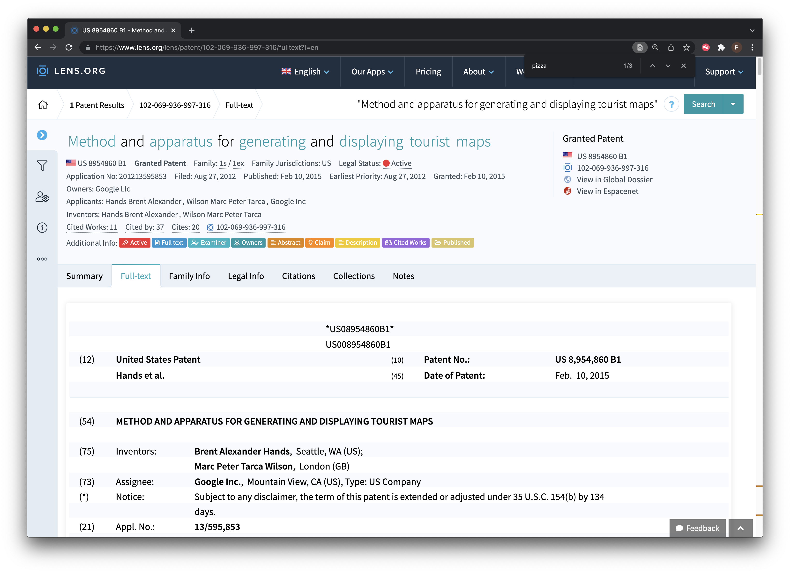
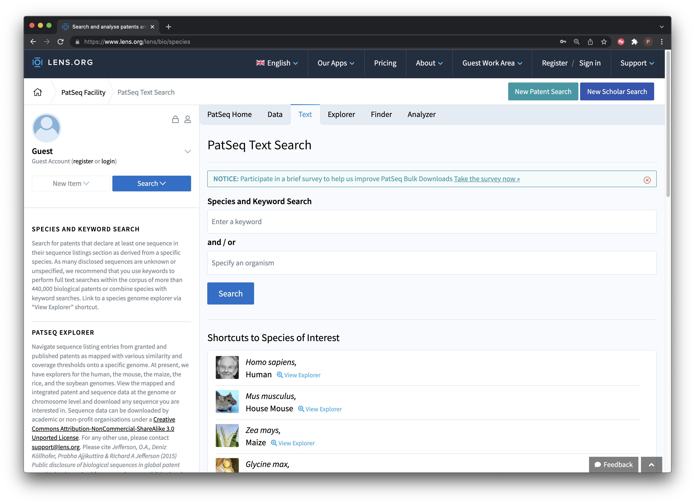

# The Lens

## Introduction

In this chapter we provide a brief introduction to [The Lens](https://www.lens.org/lens/) database as a free source of data for patent analytics. 

In the period between the first edition of this Manual in 2015 and this second edition the Lens has become the standout choice for patent analytics purposes across both free and commercial service providers. Over this period the Lens has increased coverage of the scientific literature to over 200 million records and patent records to 136 million records. In an important breakthrough the team at the Lens have also cross mapped citations between the scientific and the patent literature. As a result, and for the first time, it is possible to easily move from the scientific literature into the patent literature and from the patent literature into the citing literature. In 2020 the Lens also released Application Programming Interfaces (APIs) for the scientific literature (Scholarly API) and the patent literature (Patent API). This means that with programming knowledge it is now possible to automate search, retrieval and analysis of the scientific and patent literature. 

The pioneering improvements in the integration of the scientific and patent literature have also been accompanied by a change in business model. Whereas all Lens services were formerly free, the demands of sustaining the services mean that the non-profit Cambia is increasingly pushing towards paid services. Services remain free for individuals and those at what are called 'public good institutions' whose work can be described as non-profit while those who make professional use of the services (as lawyers, consultants or organisations) are expected to pay fees ranging from US$1,000 to US$5,000 per year for use of the main interface. Value added services such as the Application Programming Interfaces or bulk access to patent sequence or the scientific literature attract additional subscription fees. It remains to be seen how this transformation in business model will work out both for users and for Cambia. 

The patent analytics team at WIPO has made regular use of the Lens in patent analytics training workshops that have been run around the world. The Lens is a very valuable and accessible tool for learning patent analytics and we encourage readers to try it out. 


## Getting Started

To get the most out of the Lens the first step is to sign up for an account from the front page. There is an expectation that you will use your official email address, e.g., university or non-profit organisation or company. After signing up and logging in you will be asked to confirm if you are a non-profit or professional user (professional users will be expected to pay the subscription fee).

You can use the Lens without signing up for an account to search for and download records. However, your ability to download records will be limited to 1000 records (rather than 50,000) and you will not be able to save collections or search queries for later use.

```{r lens1, echo=FALSE, fig.align='center', fig.cap="The Lens Front Page"}

```

It is possible to begin searching directly from the front page. However, selecting the small button next to the search box takes you to the search controls. 

```{r lens2, echo=FALSE, fig.align='center', fig.cap="Lens Structured Search"}

```

As we can see we can use boolean queries, for searching a range of fields including the full text, title, abstract or claims (a major plus). We can also select one or multiple jurisdictions. In addition the results can be refined to patent applications or grants, and there are options for full text or one doc per family (which greatly reduces the number of results). 

We used our standard query "pizza", all jurisdictions with stemming turned stemming off (see Figure \@ref(fig:lens2). The raw results are displayed in Figure \@ref(fig:).

```{r lens3, echo=FALSE, fig.align='center', fig.cap="Lens Raw Results"}
knitr::include_graphics("images/lens/2021/Screenshot 2021-12-30 at 16.19.03.png")
```

Our search for pizza returned 44,773 patent publications in 19,856 simple families with the term "pizza" somewhere in the fill texts. As we noted in the discussion of Patentscope in Chapter 7, unless you have a compelling reason not to, it is good practice to collapse the results onto a single family record in order to reduce duplication in the dataset for analysis. If you do not collapse the data onto a single family record you will create a great deal of work for yourself later on. 

Registered users to create collections of up to 50,000 results from a search. To create a collection there are two main steps. 

1. Select all of the results in your set by clicking on the tick icon above the result set as in Figure \@ref(fig:selectall).

```{r selectall, echo=FALSE, fig.align='center', fig.cap="Select All Records"}

```

2. To the right of `All Results` in Figure \@ref(fig:selectall) choose `Create Collection` and a dialogue will open for you to name a collection as we can see in Figure \@ref(fig:createcollection). 

```{r createcollection, echo=FALSE, fig.align='center', fig.cap="Create Collection"}

```

In the Create Collection dialogue there are a number of options. 

- Choose whether to publicly or privately share a dataset;
- Choose whether to make a collection dynamic. This means that your search criteria will be preserved and an update email will be sent when new records are added. This is a very powerful feature if you work on the same topic(s) over time and works very well. Emails are only sent when new records are added;
- You are now able to add images as avatars for collections.

When creating a collection remember to add a description of the search strategy that was used and what is in the collection. This will assist others in undestanding what the data set is and "future you" in understanding why you created the collection.

For researchers, lens collections can be a very good way of sharing the results of research with the wider research community in a public way. An alternative use is to share collections with collaborators for review before publication or in the case of private sector work to share collections with co-workers or clients as part of a project. As such collections are an important feature of the Lens. <!--- insert example of the Antarctica dataset--->

An example of a public Lens collection with patent data is provided by Paul Oldham in a research project on innovation in polar regions. The full datasets created by the project are documented in a repository from the [Open Science Foundation](https://osf.io/py6ve/wiki/home/) and a paper called "Biodiversity and Innovation in Antarctica and the Southern Ocean" was made available as a preprint that analyses the data on [BioArxiv](https://doi.org/10.1101/2020.05.03.074849). The Lens [raw patent collection](https://www.lens.org/lens/search/patent/list?collectionId=179814&p=0&n=10&l=EN) was included in the documentation and can be seen in Figure \@ref(fig:antarctica).

```{r antarctica, echo=FALSE, fig.align='center', fig.cap="Create Collection"}

```

As this example suggests, the Lens can be a very powerful way of sharing data with wider audiences. These collections can also endure over long periods. For example, the pizza dataset created for the first edition of this manual in 2016 can still be access at [https://www.lens.org/lens/collection/9606](https://www.lens.org/lens/collection/9606). At that time it was not possible to create dynamic collections that would automatically update over time. 

Note that in addition to creating collections of results we also recommend that you save your queries using the button next to Create Collection on the Lens with a description of the search and when it was conducted as we see in Figure \@ref(fig:)

```{r savequery, echo=FALSE, fig.align='center', fig.cap="Create Collection"}

```

### Lens Analysis Tools

The Lens also include a set of dynamic analysis tools that appear on the right hand side of the Screen that are accessible by clicking `Analysis` as we see in Figure \@ref(fig:lensanalysis). These are standard visualisations of trends and rankings that are autogenerated at the time of search. The visuals can be edited and exported as images for use in reports. If using these images remember to credit the Lens in accordance with the terms of use. 

```{r lensanalysis, echo=FALSE, fig.align='center', fig.cap="Analysis Tab Visualisations"}

```

A range of dynamically generated visualisations are available such as the rankings of applicants, inventors and technology areas. It is also possible to drill into these visualisations to refine your data (for example to focus on a specific applicant or a technology areas such as pizza boxes for the musical pizza box that you have recently invented). As such, the analysis panel can be a useful tool for data exploration as part of the process of considering how to refine your search strategy or filter the data. 

It is important to emphasise that the analysis visualisations in the Lens should be treated as `raw`, that is, they do not necessarily accurately reflect rankings on issues such as applicant and inventor activity. Some areas of patent data require considerable work to clean up and the results of automated analysis (in the absence of detailed information on any clean up methods that have been applied) should only ever be treated as raw. Nevertheless, we would emphasise that these visualisations are a valuable exploratory device and can be used in raw form to inform discussions on potential areas for further exploration. 

### Exporting Patent Data

Data can be exported either directly from the search the search results page or from the collections page. Note that you must be logged in to export more than 1,000 records. 

When we select the export button we will be presented with a choice on the number of records to export and whether to export in JSON (for programmatic use), RIS for bibliographic software or .csv for use in tools such as Excel or other programmes. In general you will want to use the .csv format. In addition you can also select the fields that you want to export. Note here that Lens exports include both the patent title and abstract, priority data and family data (fuller data can be exported using the patent API). It can be useful to give the file a name if you are exporting multiple datasets or it can become confusing. Where the datasets are quite large the dataset will be emailed in a zipped file. 

```{r lensexport, echo=FALSE, fig.align='center', fig.cap="Exporting Data"}

```

The outputs of the export are clean and clear about what they represent when compared with some patent databases. A `url` link to the relevant file on the Lens is also provided which can assist in reviewing documents. 

```{r lensfile, echo=FALSE, fig.align='center', fig.cap="Exporting Data"}

```
### Going Further with Citations

As mentioned above, an important innovation at the Lens was linking the scientific and the patent literature collections through citations. We can see the impact of this if we conduct a simple patent search for CRISPR (for gene editing technology) as displayed in Figure \@ref(fig:citation).

```{r citation, echo=FALSE, fig.align='center', fig.cap="Raw Patent Data for CRISPR Gene editing technology"}

```
We have ranked these results using the filters menu and have chosen `Cited By Patent Count`. This helps us to identify patent documents that have had the greatest impact in the technology space (in this case in terms of the impact on what is claimed in later filings). As we might expect, a filing by Nobel Prize winner Jennifer Doudna as the original developer of CRISPR Cas-9 technology appears at the top of this list. 

However, we can also navigate into the scientific literature that is informing the development of gene editing technology by looking at the tab for "Cited Works" as dispayed in Figure \@ref(fig:scholcitation).

```{r scholcitation, echo=FALSE, fig.align='center', fig.cap="Identifying Articles Cited in Patent Documents"}

```

The scholarly citations can be ranked in various ways. In Figure \@ref(fig:scholcitation) we have ranked the data on the number of times that a publication has been cited in the wider scholarly literature (other options would be citations in the patent literature).

Exploration of the scientific literature that is cited by patents will typically reveal longstanding pioneering research (such as the Basic Local Alignment Search Tool or the legendary BLAST). More detailed analysis will expose literature closer to the subject matter such as Doudna's [RNA-guided genetic silencing systems in bacteria and archaea](https://www.lens.org/lens/scholar/article/004-462-329-767-787/main).

Working from the opposite direction we can conduct a search for CRISPR in the Lens Scholarly interface and then rank the publications on the number of citing patents as displayed in Figure \@ref(fig:scholcitation2). 

```{r scholcitation2, echo=FALSE, fig.align='center', fig.cap="Exploring Patents Citing the Scientific literature for CRISPR"}

```

## Working with texts

In common with other free databases, the Lens is not designed to allow downloads of multiple full texts (although this is possible using the new patent API). However, you can access the full text of documents, including .pdf files, and you can make notes that will be stored with a collection in your account. The image below provides an example of our ongoing efforts to understand why Google is so dominant in the results of searches for pizza in patent documents. We won't provide the answer but Figure \@ref(fig:googletexts) illustrates that we can search the different sections of patent documents to find out. 

```{r googletexts, echo=FALSE, fig.align='center', fig.cap="Exploring Google's Interest in Pizza"}

```

## PatSeq

One important focus of the development of the Lens has been DNA sequence data including an [ongoing series of articles](https://www.lens.org/about/) on the interpretation and significance of sequence data in patent activity. 

```{r patseq, echo=FALSE, fig.align='center', fig.cap="PatSeq Service"}

```

Patseq includes a number of tools. 

1. PatSeq data permits access to patent documents disclosing sequences available for bulk download from a growing number of countries. This is a very useful site for obtaining sequence data. Note that you will need to request access to download sequence data in your account area. 
2. Species finder and keyword search focuses on searching documents that contain a sequence for a species name or key term. 

```{r patseqtextsearch, echo=FALSE, fig.align='center', fig.cap="PatSeq Text Search"}

```

A series of patent portfolios have been generated for some major plant and animal species, e.g. rice, maize, humans, chickens etc. That can be downloaded as collections. 

3. The PatSeq Explorer allows the exploration of sequence data for four genomes (at present), notably the human and mouse genome for animals and the soybean, maize and rice genome for plants. Figure \@ref(fig:patseqtexthuman) displays the explorer for the human genome.

```{r patseqtexthuman, echo=FALSE, fig.align='center', fig.cap="Explore Patent Activity for the Human Genome"}

```


This is an area where researchers with [Cambia](http://www.cambia.org/daisy/cambia/home.html), the non-profit organisation behind the Lens, have invested considerable effort and it is well worth reading the research articles listed on the Cambia and Lens websites on this topic. [PatSeq Analyzer](https://www.lens.org/lens/bio/patseqanalyzer#/psa/homo_sapiens/latest/chromosome/13/32871517-32955711) is closely related to the Explorer and presently provides details on the genomes mentioned above with a detailed summary of sequences by document including the region, sequence, transcript, single nucleotide polymorphisms (SNPs) and grants with sequences in the patent claims. 

## Round Up

In recent years the Lens has become the leading open access database for the scholarly and patent literature. The ability to search hundreds of millions of scientific and patent publications free of charge, to share datasets publicly or privately and, depending on the status of the user, to download up to 50,000 records at a time free of charge cannot be rivalled by any other provider. The Lens Scholarly and Patent APIs are also powerful tools for researchers and professionals. 

